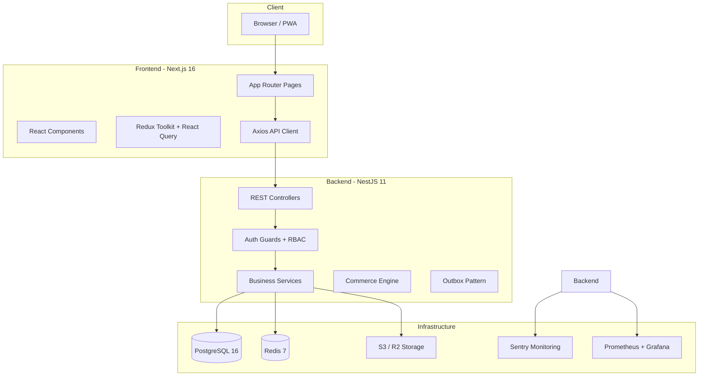
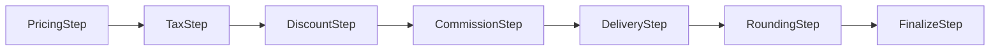
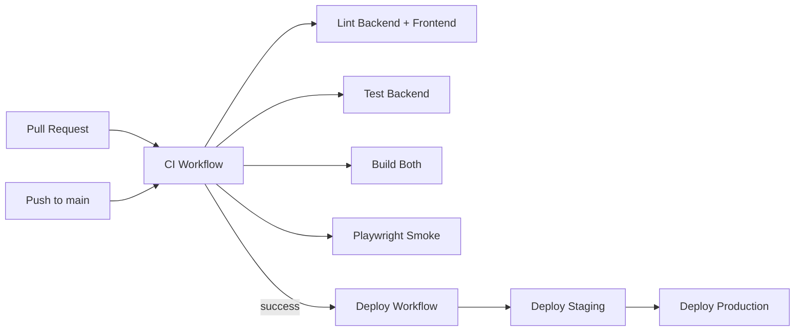

# Nutopiano — Codebase Agent Reference

> **Last updated:** 2026-02-28
> This document describes the entire Nutopiano codebase: architecture, tech stack, modules, database schema, API surface, deployment, and known issues/gaps.

---

## 1. Project Overview

**Nutopiano** is a multi-tenant, SaaS-ready e-commerce + POS platform built as a monorepo with two workspaces:

| Workspace | Tech | Port | Description |
|-----------|------|------|-------------|
| `backend/` | NestJS 11 + Prisma 7 + PostgreSQL 16 | 3001 | REST API with versioning (`/api/v1/`) |
| `frontend/` | Next.js 16 + React 19 + Tailwind CSS 4 | 3000 | SSR/CSR storefront + admin + seller + POS panels |

**Monorepo root** uses npm workspaces (`package.json` → `workspaces: ["backend", "frontend"]`).

---

## 2. High-Level Architecture



---

## 3. Tech Stack

### Backend
- **Runtime:** Node.js 20
- **Framework:** NestJS 11 (`@nestjs/core`, `@nestjs/platform-express`)
- **ORM:** Prisma 7 with `@prisma/adapter-pg` (native pg Pool)
- **Database:** PostgreSQL 16
- **Cache/Queue:** Redis 7 via BullMQ (`@nestjs/bullmq`)
- **Auth:** JWT (access 15min + refresh 7d, httpOnly cookies), bcryptjs (12 rounds), Passport
- **Validation:** `class-validator` + `class-transformer` + Joi (env validation)
- **API Docs:** Swagger (`@nestjs/swagger`) — dev only at `/docs`
- **Security:** Helmet, CSRF (double-submit cookie), rate limiting (`@nestjs/throttler` with Redis storage)
- **Monitoring:** Sentry, prom-client (Prometheus metrics)
- **Email:** Nodemailer (SMTP)
- **File Upload:** Multer (local disk or S3/R2 via `@aws-sdk/client-s3`)
- **Logging:** Custom JSON logger service

### Frontend
- **Framework:** Next.js 16 (App Router, React Compiler enabled)
- **React:** 19.2
- **State:** Redux Toolkit + React Query (TanStack Query v5)
- **Forms:** React Hook Form + Yup validation
- **Styling:** Tailwind CSS 4
- **HTTP:** Axios with interceptors (CSRF, auto-refresh)
- **Icons:** Lucide React
- **Notifications:** react-hot-toast
- **Testing:** Playwright (E2E)
- **Monitoring:** Sentry (client + server + edge)
- **Bundle Analysis:** `@next/bundle-analyzer`

### DevOps
- **CI/CD:** GitHub Actions (lint, test, build, deploy)
- **Deployment:** SSH-based deploy to staging → production (PM2 via ecosystem configs)
- **Containers:** Docker Compose (postgres, redis, backend, frontend, prometheus, grafana)
- **Monitoring Stack:** Prometheus + Grafana (optional `observability` profile)

---

## 4. Directory Structure

```
Nutopiano/
├── package.json                    # Monorepo root (npm workspaces)
├── docker-compose.yml              # Full stack Docker setup
├── ecosystem.config.cjs            # PM2 production config
├── ecosystem.staging.config.cjs    # PM2 staging config
├── .github/workflows/
│   ├── ci.yml                      # CI: lint, test, build
│   ├── deploy.yml                  # CD: staging → production
│   └── security-audit.yml          # npm audit
│
├── backend/
│   ├── prisma/
│   │   ├── schema.prisma           # 1367 lines, 40+ models
│   │   ├── seed.ts                 # Database seeding
│   │   └── migrations/             # 20+ migration files
│   ├── src/
│   │   ├── main.ts                 # Bootstrap, middleware, Swagger
│   │   ├── app.module.ts           # Root module (22 imports)
│   │   ├── app.service.ts          # Prometheus metrics
│   │   ├── auth/                   # Authentication module
│   │   ├── common/                 # Shared utilities
│   │   │   ├── authz/              # RBAC, POS permissions
│   │   │   ├── config/             # App, CORS, DB, JWT config
│   │   │   ├── constants/          # Roles, errors, messages
│   │   │   ├── decorators/         # Custom decorators
│   │   │   ├── enums/              # Order/Seller status enums
│   │   │   ├── filters/            # Global exception filter
│   │   │   ├── guards/             # JWT, Roles, StaffSelf guards
│   │   │   ├── interceptors/       # Response, Context, Metrics
│   │   │   ├── logger/             # JSON logger
│   │   │   ├── middleware/         # CSRF middleware
│   │   │   ├── throttler/          # Redis throttler storage
│   │   │   ├── types/              # Error types
│   │   │   └── utils/              # Pagination, string, validation
│   │   ├── core/
│   │   │   └── commerce/           # Calculation engine (pipeline)
│   │   │       ├── engine/         # Steps: pricing, tax, discount, commission, etc.
│   │   │       ├── contracts/      # Types and interfaces
│   │   │       └── ledger/         # Finance ledger posting service
│   │   ├── database/               # PrismaService (multi-tenant, soft-delete)
│   │   ├── dev/                    # Dev-only controller
│   │   ├── email/                  # Email service (Nodemailer)
│   │   └── modules/                # Feature modules (see Section 6)
│   └── Dockerfile
│
├── frontend/
│   ├── src/
│   │   ├── app/                    # Next.js App Router pages
│   │   │   ├── admin/              # Platform admin panel
│   │   │   ├── dashboard/          # Seller dashboard
│   │   │   ├── account/            # Customer account
│   │   │   ├── pos/                # POS terminal (214KB page!)
│   │   │   ├── checkout/           # Checkout + iyzico callback
│   │   │   ├── platform/           # Platform routes (redirect → admin)
│   │   │   ├── categories/         # Public category pages
│   │   │   ├── products/           # Public product pages
│   │   │   ├── sellers/            # Public seller pages
│   │   │   └── ...                 # login, register, search, etc.
│   │   ├── components/             # Reusable UI components
│   │   │   ├── admin/              # AdminGuard, AdminShell
│   │   │   ├── seller/             # SellerGuard, SellerShell
│   │   │   ├── auth/               # AuthBootstrap
│   │   │   ├── common/             # Button, Input, Modal, Spinner, etc.
│   │   │   └── layout/             # FooterBar, MobileBottomNav
│   │   ├── constants/              # API endpoints, app config, messages
│   │   ├── hooks/                  # useAuth, useFetch, useForm, usePagination
│   │   ├── lib/                    # Utilities (capabilities, role-routing, format, validation)
│   │   │   └── offline/            # POS offline order queue
│   │   ├── services/               # Axios API client
│   │   ├── store/                  # Redux (cart, user slices)
│   │   ├── types/                  # TypeScript types
│   │   └── proxy.ts                # Next.js middleware (auth, route protection)
│   └── Dockerfile
│
└── monitoring/                     # Prometheus + Grafana configs
```

---

## 5. Database Schema (Prisma)

### 5.1 Models (40+ total)

| Domain | Models |
|--------|--------|
| **Core** | `Business`, `User`, `RefreshToken` |
| **Seller** | `Seller`, `SellerTeamMember`, `SellerInvite`, `SellerInviteDelivery` |
| **Catalog** | `Category`, `Product`, `ProductVariant`, `ProductImage` |
| **Customer** | `Customer`, `CustomerAddress`, `CustomerPreference`, `CustomerFavorite`, `ProductReview` |
| **Orders** | `Order`, `OrderItem`, `OrderStatus`, `ReturnRequest` |
| **Payments** | `Payment`, `PaymentSession`, `PaymentWebhookEvent` |
| **Finance** | `Commission`, `Payout`, `SellerWallet`, `PlatformWallet`, `FinanceLedgerEntry`, `PayoutRequest`, `CustomerLedgerEntry` |
| **Commerce Rules** | `CalculationProfile`, `CommissionRule`, `CommissionCategoryOverride`, `SellerChannelRuleBinding` |
| **POS** | `CashRegisterSession` |
| **Appointments** | `Appointment`, `ServiceType`, `WorkingHours`, `TimeSlot`, `BlockedDate` |
| **System** | `Settings`, `Plan`, `Coupon`, `AuditLog`, `OutboxEvent` |

### 5.2 Enums

| Enum | Values |
|------|--------|
| `Role` | SUPER_ADMIN, ADMIN, SELLER, USER, CUSTOMER |
| `OrderSource` | POS, MOBILE, WEB, API |
| `PaymentMethod` | CASH, CARD, TRANSFER, OTHER |
| `PaymentProvider` | IYZICO |
| `ProductType` | PHYSICAL, SERVICE, WEIGHT, CUSTOM |
| `CommerceChannel` | MARKETPLACE, POS, MANUAL |
| `CommissionRuleType` | PERCENT, FIXED |
| `CouponType` | PERCENT, FIXED |
| `PlanInterval` | MONTHLY, YEARLY |
| `ReturnRequestStatus` | PENDING, APPROVED, REJECTED |
| `PayoutStatus` | pending, approved, completed |
| `PayoutRequestStatus` | REQUESTED, APPROVED, PAID, REJECTED |
| `FinanceLedgerDirection` | DEBIT, CREDIT |
| `FinanceLedgerAccountType` | CLEARING, SELLER_PENDING, SELLER_AVAILABLE, PLATFORM_PENDING, PLATFORM_AVAILABLE, PLATFORM_REVENUE, PLATFORM_RESERVE |
| `FinanceLedgerEventType` | ORDER_SALE, ORDER_REFUND, RELEASE_AVAILABLE, PAYOUT_REQUEST, PAYOUT_PAID, MANUAL_ADJUSTMENT |
| `AppointmentStatus` | SCHEDULED, CONFIRMED, CANCELLED, COMPLETED, NO_SHOW |
| `CategoryScopeType` | GLOBAL, SELLER_STORE |
| `SellerInviteStatus` | PENDING, ACCEPTED, DECLINED, EXPIRED |
| `CreditBlockPolicy` | NONE, WARN, BLOCK |

### 5.3 Multi-Tenancy

Every model has a `businessId` field. The `PrismaService` automatically injects `businessId` filters via Prisma middleware for all business-scoped models (30+ models listed in `BUSINESS_SCOPED_MODELS`). Soft-delete is applied to `Customer` and `Order` models.

---

## 6. Backend Modules

### 6.1 Module Map

| Module | Controller(s) | Service | Key Responsibilities |
|--------|--------------|---------|---------------------|
| **AuthModule** | `AuthController` | `AuthService` | Login, register, JWT refresh, forgot/reset password, profile update |
| **UsersModule** | `UsersController` | `UsersService` | User CRUD, role management |
| **CustomersModule** | `CustomersController`, `CustomerPortalController`, `PlatformCustomersController` | `CustomersService` | Customer CRUD, addresses, favorites, reviews, preferences, ledger |
| **CategoriesModule** | `CategoriesController`, `PublicCategoriesController` | `CategoriesService` | Category tree CRUD, seller-scoped categories |
| **ProductsModule** | `ProductsController` | `ProductsService` | Product CRUD, variants, images, CSV import, publish/unpublish |
| **OrdersModule** | `OrdersController`, `PlatformOrdersController` | `OrdersService` | Order lifecycle, status transitions, returns, shipment tracking |
| **OrderStatusModule** | `OrderStatusController` | `OrderStatusService` | Custom order status definitions |
| **PaymentsModule** | `PaymentsIyzicoController`, `PaymentsAdminController`, `PaymentsWebhooksController` | `PaymentsService`, `PaymentsProcessorService` | iyzico HPP integration, webhook processing, BullMQ queue |
| **PosModule** | `PosController` | `PosService` | POS sales, register sessions, stock management, returns, split payments |
| **SellersModule** | `SellersController`, `PublicSellersController` | `SellersService`, `InviteDeliveryService` | Seller onboarding, team management, invites, product management |
| **FinanceModule** | `FinanceController` | `FinanceService` | Wallets, ledger, payouts, commission tracking, financial reports |
| **CommerceRulesModule** | `CommerceRulesController` | `CommerceRulesService` | Calculation profiles, commission rules, category overrides, channel bindings |
| **CommerceModule** | — | `CommerceCalculationService` | Calculation engine (pipeline: pricing → tax → discount → commission → shipping → rounding → finalize) |
| **MarketplaceModule** | `MarketplaceController` | `MarketplaceService` | Public marketplace product listing with Redis caching |
| **DashboardModule** | `DashboardController` | `DashboardService` | Seller dashboard analytics |
| **AppointmentsModule** | `AppointmentsController` | `AppointmentsService` | Appointment booking, service types, working hours |
| **PlansModule** | `PlansController` | `PlansService` | Subscription plan CRUD |
| **SettingsModule** | `SettingsController` | `SettingsService` | Key-value settings per business |
| **UploadsModule** | `UploadsController` | `UploadsService` | File upload (local disk or S3/R2) |
| **AuditModule** | `AuditController` | `AuditService` | Audit log recording and querying |
| **OutboxModule** | `OutboxController` | `OutboxService`, `OutboxWorkerService` | Transactional outbox pattern for reliable event processing |
| **HealthModule** | `HealthController` | `HealthService` | Health checks (DB, Redis, disk) |
| **EmailModule** | — | `EmailService` | SMTP email sending |
| **DatabaseModule** | — | `PrismaService` | Database connection, multi-tenant middleware, soft-delete |

### 6.2 Commerce Calculation Engine

The commerce engine uses a **pipeline pattern** with ordered steps:



Each step implements `CalculationStep.execute(ctx)` and mutates the `CalculationWorkingContext`. The engine produces a deterministic `calculationVersion` hash for audit/reproducibility.

### 6.3 Finance Ledger

Double-entry bookkeeping with account types:
- **CLEARING** — holds funds during order processing
- **SELLER_PENDING** / **SELLER_AVAILABLE** — seller wallet states
- **PLATFORM_PENDING** / **PLATFORM_AVAILABLE** / **PLATFORM_REVENUE** / **PLATFORM_RESERVE** — platform wallet states

Events: `ORDER_SALE`, `ORDER_REFUND`, `RELEASE_AVAILABLE`, `PAYOUT_REQUEST`, `PAYOUT_PAID`, `MANUAL_ADJUSTMENT`

---

## 7. Authentication & Authorization

### 7.1 Auth Flow

1. **Login** (`POST /auth/login`) → returns access token (15min) + refresh token (7d) as httpOnly cookies
2. **Token Refresh** (`POST /auth/refresh`) → rotates refresh token, issues new access token
3. **Logout** (`POST /auth/logout`) → revokes refresh token
4. Refresh tokens are stored in DB with `jti`, `tokenHash` (SHA-256), rotation tracking

### 7.2 Role Hierarchy

| Role | Effective Role | Access |
|------|---------------|--------|
| `SUPER_ADMIN` | ADMIN | Full platform access |
| `ADMIN` | ADMIN | Full business access |
| `SELLER` | SELLER | Seller dashboard, POS, own products/orders |
| `USER` | VIEWER | Limited staff access (POS with permissions) |
| `CUSTOMER` | CUSTOMER | Storefront, account, orders |

### 7.3 POS Permissions

Staff members (`USER` role) have granular POS permissions stored as JSON:
- `pos.sales` — can create sales
- `pos.orders` — can manage orders
- `pos.reports` — can view reports

Presets: `sales`, `orders`, `reports`, `full_pos`

### 7.4 Frontend Route Protection

`proxy.ts` (Next.js middleware) protects routes:
- `/admin/*` → requires ADMIN role
- `/platform/*` → redirects to `/admin/*` (308)
- `/dashboard/*`, `/pos/*`, `/account/*` → requires authentication
- JWT role decoded client-side from cookie for route guards

---

## 8. Frontend Architecture

### 8.1 Page Structure

| Route | Panel | Description |
|-------|-------|-------------|
| `/` | Public | Homepage |
| `/products`, `/categories`, `/sellers` | Public | Storefront browsing |
| `/cart`, `/checkout` | Public | Shopping cart and checkout |
| `/login`, `/register`, `/forgot-password` | Public | Auth pages |
| `/account/*` | Customer | Profile, orders, addresses, favorites, reviews, settings |
| `/admin/*` | Admin | Full admin panel (users, sellers, products, orders, finance, etc.) |
| `/dashboard/*` | Seller | Seller dashboard (products, orders, customers, finance, campaigns) |
| `/pos` | POS | Point-of-sale terminal (single 214KB page) |
| `/platform/*` | Platform | Redirects to `/admin/*` |

### 8.2 State Management

- **Redux Toolkit:** Cart state (persisted to localStorage), User state
- **React Query:** Server state (API data fetching, caching)
- **React Hook Form + Yup:** Form state and validation

### 8.3 API Client

`services/api.ts` — Axios instance with:
- Auto CSRF token injection for unsafe methods
- Auto token refresh on 401 responses
- Response unwrapping (`{ success, data }` → `data`)

### 8.4 Capabilities System

Frontend has a capability-based access control:
- `VIEW_FINANCE`, `EXECUTE_OVERRIDE`, `VIEW_AUDIT`, `MANAGE_SELLERS`, `PROCESS_RETURN`, `CLOSE_REGISTER`, `FORCE_PUBLISH`, `FORCE_STOCK`, `VIEW_OUTBOX`, `MANAGE_PAYOUT`, `VIEW_REPORTS`, `USE_POS`, `VIEW_SUPPORT_MODE`, `EXECUTE_BULK_ACTIONS`
- Mapped per effective role (ADMIN gets all, SELLER gets subset, VIEWER gets USE_POS only)

---

## 9. API Surface

### 9.1 Base URL

- Development: `http://localhost:3001/api/v1`
- Production: `https://api.nutopiano.com/api/v1`

### 9.2 Key Endpoints

| Group | Endpoints |
|-------|-----------|
| **Auth** | `POST /auth/login`, `POST /auth/register`, `POST /auth/logout`, `POST /auth/refresh`, `POST /auth/forgot-password`, `POST /auth/reset-password`, `GET /auth/verify`, `PUT /auth/profile`, `PUT /auth/change-password` |
| **Users** | `GET /users`, `GET /users/:id`, `PUT /users/:id`, `DELETE /users/:id`, `PUT /users/:id/role` |
| **Customers** | `GET /customers`, `POST /customers`, `GET /customers/:id`, `PUT /customers/:id`, `DELETE /customers/:id` |
| **Products** | `GET /products`, `POST /products`, `GET /products/:id`, `PUT /products/:id`, `DELETE /products/:id`, `GET /products/search` |
| **Categories** | `GET /categories`, `POST /categories`, `GET /categories/:id`, `PUT /categories/:id`, `DELETE /categories/:id` |
| **Orders** | `GET /orders`, `POST /orders`, `GET /orders/:id`, `PUT /orders/:id`, `PUT /orders/:id/status`, `POST /orders/:id/cancel` |
| **Payments** | `POST /payments/iyzico/initialize`, `GET /payments/iyzico/callback`, `POST /payments/webhooks/iyzico` |
| **POS** | `POST /pos/sale`, `GET /pos/products`, `POST /pos/register/open`, `POST /pos/register/close`, `POST /pos/return` |
| **Sellers** | `GET /sellers`, `POST /sellers`, `GET /sellers/:id`, `PUT /sellers/:id`, `POST /sellers/:id/invite` |
| **Finance** | `GET /finance/wallets`, `GET /finance/ledger`, `POST /finance/payout-request`, `PUT /finance/payout/:id/approve` |
| **Settings** | `GET /settings/:key`, `PUT /settings/:key` |
| **Uploads** | `POST /uploads/image`, `POST /uploads/file` |
| **Health** | `GET /health` |
| **Metrics** | `GET /metrics` (Prometheus) |

### 9.3 Response Format

All responses wrapped in:
```json
{
  "success": true,
  "data": { ... },
  "message": "optional message"
}
```

Error responses:
```json
{
  "success": false,
  "code": "VALIDATION_FAILED",
  "message": "Error description",
  "errors": [],
  "details": null,
  "requestId": "uuid",
  "timestamp": "ISO-8601"
}
```

---

## 10. Deployment & Infrastructure

### 10.1 Docker Compose Services

| Service | Image | Port | Notes |
|---------|-------|------|-------|
| `postgres` | postgres:16-alpine | 5432 | With healthcheck |
| `redis` | redis:7-alpine | 6379 | With healthcheck |
| `backend` | Custom Dockerfile | 3001 | Auto-runs migrations on start |
| `frontend` | Custom Dockerfile | 3000 | Depends on backend health |
| `prometheus` | prom/prometheus:v2.54.1 | 9090 | Observability profile |
| `grafana` | grafana/grafana:11.2.0 | 3003 | Observability profile |

### 10.2 CI/CD Pipeline



### 10.3 PM2 Process Management

- `ecosystem.config.cjs` — production config
- `ecosystem.staging.config.cjs` — staging config

### 10.4 Environment Variables

Key variables (see `backend/.env.example`):
- `DATABASE_URL` — PostgreSQL connection string
- `JWT_SECRET` — JWT signing secret
- `ALLOWED_ORIGINS` — CORS origins
- `REDIS_URL` — Redis connection
- `S3_*` — Object storage (optional)
- `SMTP_*` — Email sending (optional)
- `SENTRY_DSN` — Error monitoring (optional)
- `PUBLIC_BUSINESS_ID` — Default business for public storefront

---

## 11. Security Features

| Feature | Implementation |
|---------|---------------|
| **CSRF Protection** | Double-submit cookie pattern (`__csrf` cookie + `X-CSRF-Token` header) |
| **Rate Limiting** | `@nestjs/throttler` with Redis storage (60 req/min default, 5 req/15min for auth) |
| **Helmet** | HTTP security headers |
| **Password Hashing** | bcryptjs with 12 salt rounds |
| **JWT Security** | Short-lived access tokens (15min), refresh token rotation with DB tracking |
| **Input Validation** | `class-validator` with whitelist + forbidNonWhitelisted |
| **Multi-Tenant Isolation** | Automatic `businessId` filtering on all queries |
| **Soft Delete** | Customer and Order models |
| **Audit Logging** | `AuditLog` model for tracking admin actions |
| **Error Handling** | Global exception filter with structured error responses, no stack traces in production |

---

## 12. Known Issues & Gaps

### 12.1 Critical Issues

1. **`useAuth` hook is a stub** — [`useAuth.ts`](frontend/src/hooks/useAuth.ts:28) has `login`, `logout`, `register` methods that only `console.log`. The actual auth flow is handled elsewhere (AuthBootstrap + direct API calls), but this hook is misleading and potentially used incorrectly.

2. **POS page is 214KB** — [`pos/page.tsx`](frontend/src/app/pos/page.tsx:1) is a single massive file. This is a maintainability and performance concern. Should be split into components.

3. **Large service files** — Several backend services are extremely large:
   - [`orders.service.ts`](backend/src/modules/orders/orders.service.ts:1) — 96KB
   - [`pos.service.ts`](backend/src/modules/pos/pos.service.ts:1) — 75KB
   - [`finance.service.ts`](backend/src/modules/finance/finance.service.ts:1) — 66KB
   - [`sellers.service.ts`](backend/src/modules/sellers/sellers.service.ts:1) — 64KB
   - [`products.service.ts`](backend/src/modules/products/products.service.ts:1) — 47KB
   These should be refactored into smaller, focused services.

4. **Inconsistent enum casing** — `PayoutStatus` uses lowercase (`pending`, `approved`, `completed`) while all other enums use UPPER_CASE. This inconsistency can cause bugs.

### 12.2 Architecture Gaps

5. **No WebSocket/SSE support** — Real-time features (POS sync, order notifications) are not implemented. The outbox pattern exists but has no real-time delivery mechanism.

6. **No queue workers for most tasks** — BullMQ is only used for payment webhook processing. Email sending, outbox processing, and other async tasks run synchronously or via polling.

7. **No caching strategy** — Only marketplace has Redis caching (`MARKETPLACE_CACHE_TTL_SECONDS`). Products, categories, and other frequently accessed data have no caching layer.

8. **No API versioning strategy** — While `/api/v1` prefix exists, there is no v2 plan or deprecation strategy. Legacy route mapping exists in `main.ts`.

9. **Missing test coverage** — Only a few spec files exist (`app.controller.spec.ts`, `auth.service.spec.ts`, `calculation-engine.spec.ts`). Most modules have zero unit tests.

### 12.3 Security Gaps

10. **JWT secret has a default value** — [`app.config.ts`](backend/src/common/config/app.config.ts:24) defaults `JWT_SECRET` to `dev_jwt_secret_change_me`. In production, if not set, this is a critical vulnerability.

11. **No IP-based rate limiting** — Throttler uses Redis but does not appear to differentiate by IP for anonymous requests.

12. **CSRF middleware uses deprecated `csurf`** — The `csurf` package is deprecated and has known vulnerabilities. Should migrate to a custom implementation or alternative.

13. **No Content Security Policy (CSP)** — Helmet is used but CSP headers are not explicitly configured.

### 12.4 Frontend Gaps

14. **No error boundaries per route** — Only a global `error.tsx` exists. Individual route segments lack error boundaries.

15. **No loading states per route** — Only a global `loading.tsx` exists. Individual pages handle loading inconsistently.

16. **Many platform pages are stubs** — Several `/platform/*` pages contain only a redirect number (35-72 chars), suggesting they are placeholder files.

17. **No i18n support** — The app is hardcoded in Turkish (`lang="tr"`). No internationalization framework is in place.

18. **No PWA offline support** — Service worker registration exists in `providers.tsx` but no `sw.js` file was found in the public directory.

19. **Duplicate API base URL definitions** — `API_BASE_URL` is defined in both [`services/api.ts`](frontend/src/services/api.ts:4) and [`constants/api.constants.ts`](frontend/src/constants/api.constants.ts:6).

### 12.5 Database Gaps

20. **No database backup automation** — `.env.example` mentions `BACKUP_DIR` and `BACKUP_RETENTION_DAYS` but no backup script was found in the repository.

21. **SKU uniqueness is commented out** — In the Product model, `@@unique([businessId, sku])` is commented out, meaning duplicate SKUs are allowed per business.

22. **No full-text search** — Product search likely uses `LIKE` queries. No PostgreSQL full-text search or external search engine (Elasticsearch) is configured.

23. **PaymentSession status is a string** — [`PaymentSession.status`](backend/prisma/schema.prisma:1078) uses `String` instead of an enum, allowing arbitrary values.

### 12.6 DevOps Gaps

24. **No staging environment separation** — Docker compose uses the same database credentials for all environments. No environment-specific compose files.

25. **No database migration rollback strategy** — Prisma migrations are forward-only. No documented rollback procedure.

26. **No health check for Redis in backend** — The health module checks DB but Redis health is not verified in the health endpoint.

27. **No log aggregation** — JSON logger exists but no log shipping to a centralized system (ELK, Loki, etc.).

---

## 13. Key File Reference

### Backend Entry Points
| File | Purpose |
|------|---------|
| [`backend/src/main.ts`](backend/src/main.ts:1) | Application bootstrap |
| [`backend/src/app.module.ts`](backend/src/app.module.ts:1) | Root module with all imports |
| [`backend/src/app.service.ts`](backend/src/app.service.ts:1) | Prometheus metrics |
| [`backend/prisma/schema.prisma`](backend/prisma/schema.prisma:1) | Database schema |

### Backend Core
| File | Purpose |
|------|---------|
| [`backend/src/database/prisma.service.ts`](backend/src/database/prisma.service.ts:1) | Multi-tenant Prisma client |
| [`backend/src/auth/auth.service.ts`](backend/src/auth/auth.service.ts:1) | Authentication logic |
| [`backend/src/common/authz/roles.ts`](backend/src/common/authz/roles.ts:1) | Role normalization |
| [`backend/src/common/authz/pos-permissions.ts`](backend/src/common/authz/pos-permissions.ts:1) | POS permission system |
| [`backend/src/core/commerce/engine/calculation-engine.ts`](backend/src/core/commerce/engine/calculation-engine.ts:1) | Commerce calculation pipeline |
| [`backend/src/core/commerce/ledger/ledger-posting.service.ts`](backend/src/core/commerce/ledger/ledger-posting.service.ts:1) | Finance ledger posting |

### Frontend Entry Points
| File | Purpose |
|------|---------|
| [`frontend/src/app/layout.tsx`](frontend/src/app/layout.tsx:1) | Root layout |
| [`frontend/src/app/providers.tsx`](frontend/src/app/providers.tsx:1) | Redux + React Query + Auth providers |
| [`frontend/src/proxy.ts`](frontend/src/proxy.ts:1) | Next.js middleware (route protection) |
| [`frontend/src/services/api.ts`](frontend/src/services/api.ts:1) | Axios API client |
| [`frontend/src/store/index.ts`](frontend/src/store/index.ts:1) | Redux store configuration |

### Frontend Key Libraries
| File | Purpose |
|------|---------|
| [`frontend/src/lib/role-routing.ts`](frontend/src/lib/role-routing.ts:1) | Role normalization and routing |
| [`frontend/src/lib/capabilities.ts`](frontend/src/lib/capabilities.ts:1) | Capability-based access control |
| [`frontend/src/lib/pos-permissions.ts`](frontend/src/lib/pos-permissions.ts:1) | POS permission checks |
| [`frontend/src/constants/api.constants.ts`](frontend/src/constants/api.constants.ts:1) | API endpoint definitions |

---

## 14. Development Quick Start

```bash
# 1. Start infrastructure
docker compose up -d postgres redis

# 2. Install dependencies
npm install

# 3. Setup backend
cd backend
cp .env.example .env  # Edit DATABASE_URL, JWT_SECRET
npx prisma migrate deploy
npx prisma generate
cd ..

# 4. Start development
npm run dev:backend    # Backend on :3001
npm run dev:frontend   # Frontend on :3000

# 5. Access
# Storefront: http://localhost:3000
# API Docs:   http://localhost:3001/docs
# Health:     http://localhost:3001/api/v1/health
```

---

## 15. Conventions

- **Currency:** All monetary values stored as integers in cents (`*Cents` suffix)
- **Commission rates:** Stored as basis points (`*Bps` suffix, 1 bps = 0.01%)
- **Multi-tenancy:** Every query scoped by `businessId`
- **API versioning:** URI-based (`/api/v1/`)
- **Response wrapping:** All responses wrapped in `{ success, data, message }`
- **Error codes:** Standardized error codes in `error.constants.ts`
- **Soft delete:** `deletedAt` field on Customer and Order
- **Timestamps:** `createdAt` + `updatedAt` on all models
- **Naming:** camelCase for code, snake_case for DB columns (Prisma handles mapping)
