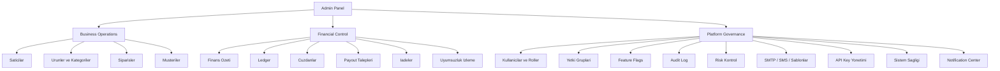

# Nutopiano Admin Paneli — UI/UX Planlama Dokümanı v2

> **Tarih:** 2026-02-28
> Bu doküman, admin panelinin tüm özelliklerini, mevcut durumunu, eksiklerini ve yeniden tasarım planını kapsar.
> **v2 Güncellemesi:** Feature flags, 2FA, impersonation, notification center, API key yönetimi, sistem sağlık dashboard'u ve gelişmiş POS yetkileri eklendi.

---

## 1. Mevcut Durum Analizi

### 1.1 Admin Paneli Mevcut Sayfalar

| Sayfa | Dosya | Durum | Açıklama |
|-------|-------|-------|----------|
| Genel Bakış | `/admin/page.tsx` | ✅ Aktif | Dashboard özeti, sipariş listesi, gelir |
| Kullanıcılar | `/admin/users/page.tsx` | ✅ Aktif | Kullanıcı listesi, rol değiştirme, aktif/pasif |
| Satıcılar | `/admin/sellers/page.tsx` | ✅ Aktif | Satıcı listesi, aktif/pasif filtre |
| Satıcı Detay | `/admin/sellers/[id]/page.tsx` | ✅ Aktif | Satıcı detay sayfası |
| Satıcı Başvuruları | `/admin/sellers/applications/page.tsx` | ✅ Aktif | Başvuru listesi |
| Ürünler | `/admin/products/page.tsx` | ✅ Aktif | Ürün yönetimi (43KB) |
| Kategoriler | `/admin/categories/page.tsx` | ✅ Aktif | Kategori ağacı yönetimi |
| Katalog | `/admin/catalog/page.tsx` | ✅ Aktif | Katalog görünümü |
| Finans Özeti | `/admin/finance/page.tsx` | ✅ Aktif | Finans dashboard (45KB) |
| Payout | `/admin/finance/payouts/page.tsx` | ✅ Aktif | Ödeme talepleri |
| Ödemeler | `/admin/payments/page.tsx` | ✅ Aktif | Ödeme listesi |
| Webhook | `/admin/payments/webhooks/page.tsx` | ✅ Aktif | Webhook olayları |
| Planlar | `/admin/plans/page.tsx` | ✅ Aktif | Abonelik planları |
| Risk Kontrol | `/admin/risk-control/page.tsx` | ✅ Aktif | Risk izleme |
| Hizmetler | `/admin/services/page.tsx` | ✅ Aktif | Randevu hizmetleri |
| SMTP Ayarları | `/admin/smtp/page.tsx` | ✅ Aktif | Mail sunucu ayarları |
| SMS Ayarları | `/admin/sms/page.tsx` | ✅ Aktif | SMS ayarları ve şablonları |
| **Siparişler** | `/admin/orders/page.tsx` | ⚠️ Stub | Dashboard orders sayfasına yönlendirme |
| **Müşteriler** | `/admin/customers/page.tsx` | ⚠️ Stub | Dashboard customers sayfasına yönlendirme |
| **Raporlar** | `/admin/reports/page.tsx` | ⚠️ Stub | Dashboard reports sayfasına yönlendirme |
| **Ayarlar** | `/admin/settings/page.tsx` | ⚠️ Stub | Dashboard settings sayfasına yönlendirme |
| Finans Ledger | `/admin/finance/ledger/page.tsx` | ❌ Boş | Sadece 35 karakter |
| Finans Cüzdanlar | `/admin/finance/wallets/page.tsx` | ❌ Boş | Sadece 35 karakter |
| Finans İadeler | `/admin/finance/refunds/page.tsx` | ❌ Boş | Sadece 35 karakter |
| Finans Uyumsuzluk | `/admin/finance/mismatch-monitor/page.tsx` | ❌ Boş | Sadece 35 karakter |

### 1.2 Mevcut Yetki Sistemi

**Roller:**
| Rol | Etkin Rol | Erişim |
|-----|-----------|--------|
| `SUPER_ADMIN` | ADMIN | Tüm platform erişimi |
| `ADMIN` | ADMIN | İş yeri tam erişim |
| `SELLER` | SELLER | Satıcı paneli, POS, kendi ürün/sipariş |
| `USER` | VIEWER | Sınırlı personel erişimi (POS izinleri) |
| `CUSTOMER` | CUSTOMER | Mağaza, hesap, siparişler |

**Mevcut Yetenekler (Capabilities):**
- `VIEW_FINANCE`, `EXECUTE_OVERRIDE`, `VIEW_AUDIT`, `MANAGE_SELLERS`, `PROCESS_RETURN`, `CLOSE_REGISTER`, `FORCE_PUBLISH`, `FORCE_STOCK`, `VIEW_OUTBOX`, `MANAGE_PAYOUT`, `VIEW_REPORTS`, `USE_POS`, `VIEW_SUPPORT_MODE`, `EXECUTE_BULK_ACTIONS`

### 1.3 Tespit Edilen Sorunlar

1. **Stub sayfalar** — Siparişler, müşteriler, raporlar, ayarlar admin panelinde kendi sayfaları yok
2. **Yetki sistemi yetersiz** — Sadece capability bazlı, granüler izin grupları yok
3. **Kullanıcı grupları yok** — Satıcı altındaki kullanıcılar ve admin kullanıcıları ayrı yönetilemiyor
4. **Kullanıcı hareketleri (audit) eksik** — AuditLog modeli var ama admin panelinde görüntüleme sayfası yok
5. **Mail şablonları yok** — SMTP ayarları var ama mail şablonları yönetimi yok
6. **SMS şablonları sınırlı** — Sadece 2 şablon var
7. **Yetki grupları yok** — Roller sabit, özelleştirilebilir yetki grupları tanımlanamıyor
8. **Feature flag sistemi yok** — Kademeli rollout yapılamıyor
9. **2FA yok** — Admin panelinde iki faktörlü doğrulama yok (finans için kritik)
10. **Impersonation yok** — Admin satıcı/müşteri olarak görüntüleme yapamıyor
11. **Notification center yok** — Sistem uyarıları merkezi bir yerde gösterilmiyor
12. **Soft delete eksik** — Kullanıcı ve ürünlerde kalıcı silme riski
13. **API key yönetimi yok** — Marketplace API erişimi için gerekli
14. **Sistem sağlık dashboard'u yok** — Queue, outbox, SMTP, SMS, DB durumu izlenemiyor

---

## 2. Admin Paneli Mimari Yapı — 3 Katman



---

## 3. Sidebar Navigasyon Yapısı

```mermaid
graph TD
    A[Admin Panel] --> B[Genel Bakis + Sistem Sagligi]
    A --> C[Business Operations]
    A --> D[Financial Control]
    A --> E[Platform Governance]

    C --> C1[Satici Listesi]
    C --> C2[Satici Basvurulari]
    C --> C3[Satici Kullanicilari]
    C --> C4[Urun Yonetimi]
    C --> C5[Kategori Yonetimi]
    C --> C6[Katalog]
    C --> C7[Siparisler]
    C --> C8[Musteriler]

    D --> D1[Finans Ozeti]
    D --> D2[Ledger]
    D --> D3[Cuzdanlar]
    D --> D4[Payout Talepleri]
    D --> D5[Iadeler]
    D --> D6[Uyumsuzluk Izleme]

    E --> E1[Kullanicilar]
    E --> E2[Roller ve Yetkiler]
    E --> E3[Yetki Gruplari]
    E --> E4[Feature Flags]
    E --> E5[Kullanici Hareketleri]
    E --> E6[Risk Kontrol]
    E --> E7[Mail Sunucu + Sablonlar]
    E --> E8[SMS Ayarlari + Sablonlar]
    E --> E9[API Key Yonetimi]
    E --> E10[Planlar]
    E --> E11[Genel Ayarlar]
    E --> E12[Raporlar]
```



---

## 4. Modül Detayları

### 4.1 Genel Bakış + Sistem Sağlığı Dashboard

**Mevcut:** Basit dashboard (ürün, sipariş, gelir özeti)
**Hedef:**
- Mevcut istatistikler (ürün, sipariş, gelir)
- **Sistem Sağlığı Paneli (YENİ)**
  - Queue uzunluğu (BullMQ)
  - Outbox backlog sayısı
  - SMTP durumu (bağlı/bağlı değil)
  - SMS sağlayıcı durumu
  - DB gecikme süresi (latency)
  - Redis durumu
  - Payment gateway durumu (iyzico)
  - Son 24 saat hata sayısı
- **Notification Center (YENİ)**
  - Payout bekliyor bildirimi
  - Ledger mismatch uyarısı
  - Risk alarmı
  - SMTP çalışmıyor uyarısı
  - SMS quota doldu uyarısı
  - Severity: info / warning / critical
  - Dismiss edilebilir
  - Audit log'a yazılır

---

### 4.2 Business Operations — Satıcılar

#### 4.2.1 Satıcı Listesi
**Mevcut:** Basit liste, aktif/pasif filtre
**Hedef:**
- Satıcı listesi (kart + tablo görünümü)
  - Logo, ad, slug, durum, ürün sayısı, sipariş sayısı, toplam ciro
  - Arama, filtreler (durum, oluşturma tarihi)
  - Sayfalama
- Satıcı detay sayfası (genişletilmiş)
  - Profil bilgileri düzenleme
  - Satıcı ürünleri listesi
  - Satıcı siparişleri listesi
  - Satıcı finans özeti (cüzdan bakiyesi, komisyon)
  - Satıcı ekibi yönetimi
  - Satıcı ayarları
  - **Impersonation butonu: "Satıcı olarak görüntüle" (YENİ)**

#### 4.2.2 Satıcı Başvuruları
**Mevcut:** Başvuru listesi
**Hedef:**
- Başvuru listesi (bekleyen, onaylanan, reddedilen)
- Başvuru detay sayfası
  - Başvuru bilgileri
  - Onaylama / Reddetme aksiyonları
  - Red nedeni yazma
  - Otomatik satıcı hesabı oluşturma (onay sonrası)

#### 4.2.3 Satıcı Kullanıcıları (Ekip Yönetimi)
**Mevcut:** Satıcı detay sayfasında kısmen var
**Hedef:**
- Tüm satıcı kullanıcılarını tek sayfada görme (admin bakış açısı)
  - Satıcı adı, kullanıcı adı, rol, POS izinleri, durum
  - Satıcıya göre filtreleme
- Kullanıcı ekleme/çıkarma
- POS izinleri düzenleme (genişletilmiş — bkz. 4.8)
- Davet gönderme (e-posta/SMS)

---

### 4.3 Business Operations — Ürünler ve Kategoriler

#### 4.3.1 Ürün Yönetimi
**Mevcut:** 43KB sayfa, temel CRUD
**Hedef:**
- Ürün listesi
  - Tablo + kart görünümü
  - Arama, filtreler (kategori, satıcı, durum, fiyat aralığı, stok durumu)
  - Toplu işlemler (yayınla, geri çek, sil, kategori değiştir)
  - CSV import/export
- Ürün detay/düzenleme sayfası
  - Temel bilgiler (ad, açıklama, fiyat, maliyet, SKU)
  - Kategori seçimi (ağaç yapısı)
  - Varyant yönetimi (renk, beden, malzeme)
  - Görsel yönetimi (sürükle-bırak sıralama, birincil görsel)
  - SEO ayarları
  - Stok yönetimi
  - Yayın durumu
  - Satıcı ataması
- Ürün oluşturma wizard
- **Soft delete + arşivleme (YENİ)** — Silinen ürünler arşive taşınır, geri yüklenebilir

#### 4.3.2 Kategori Yönetimi
**Mevcut:** Kategori ağacı, CRUD
**Hedef:**
- Kategori ağacı görünümü (sürükle-bırak sıralama)
- Kategori oluşturma/düzenleme modal
  - Ad, slug, üst kategori, durum, sıra
  - Kapsam tipi (GLOBAL / SELLER_STORE)
  - Satıcı ataması (SELLER_STORE için)
- Kategori silme (alt kategoriler kontrolü)
- Komisyon override ayarları (kategori bazlı)
- **Soft delete + arşivleme (YENİ)**

---

### 4.4 Business Operations — Siparişler (Admin Özel Sayfası)

**Mevcut:** Dashboard orders sayfasına yönlendirme (stub)
**Hedef:**
- Admin siparişler sayfası (tüm satıcıların siparişleri)
  - Sipariş listesi
    - Sipariş no, müşteri, satıcı, tutar, durum, kaynak (POS/WEB/API), tarih
    - Arama (sipariş no, müşteri adı/telefon)
    - Filtreler: Durum, satıcı, kaynak, tarih aralığı, tutar aralığı
    - Sayfalama
  - Sipariş detay sayfası
    - Sipariş bilgileri
    - Ürün kalemleri (fiyat, vergi, komisyon dağılımı)
    - Ödeme bilgileri
    - Kargo takip bilgileri
    - Durum geçmişi
    - İade talepleri
    - Finans ledger kayıtları
    - Hesaplama profili ve versiyon bilgisi (**Config snapshot — YENİ**)
  - Durum güncelleme
  - İade onaylama/reddetme
  - Sipariş iptal
  - **Soft delete + arşivleme (YENİ)** — İptal edilen siparişler arşive taşınır

---

### 4.5 Business Operations — Müşteriler (Admin Özel Sayfası)

**Mevcut:** Dashboard customers sayfasına yönlendirme (stub)
**Hedef:**
- Admin müşteriler sayfası (tüm satıcıların müşterileri)
  - Müşteri listesi
    - Ad, telefon, bakiye, sipariş sayısı, toplam harcama, kayıt tarihi
    - Arama, filtreler
    - Sayfalama
  - Müşteri detay sayfası
    - Profil bilgileri
    - Adresler
    - Sipariş geçmişi
    - Bakiye hareketleri (ledger)
    - Favoriler
    - Değerlendirmeler
    - Tercihler (SMS, e-posta, KVKK)
  - Bakiye yönetimi (ekleme/çıkarma)
  - **Soft delete + geri yükleme (YENİ)**

---

### 4.6 Financial Control — Finans

#### 4.6.1 Finans Özeti
**Mevcut:** 45KB sayfa, kapsamlı dashboard
**Hedef:** Mevcut yapıyı koruyarak iyileştirme
- Sağlık göstergeleri (ledger tutarlılık, cüzdan sağlığı, risk)
- Günlük/haftalık/aylık gelir grafikleri
- Uzlaştırma (reconciliation) durumu
- **Config version tracking (YENİ)** — Hangi hesaplama versiyonuyla hesaplandığı

#### 4.6.2 Ledger Sayfası
**Mevcut:** Boş stub
**Hedef:**
- Ledger kayıtları tablosu
  - Tarih, olay tipi, hesap tipi, yön (borç/alacak), tutar, sipariş, satıcı
  - Filtreler: Olay tipi, hesap tipi, satıcı, tarih aralığı
  - Sayfalama
- Ledger detay modal
- Dışa aktarma (CSV)

#### 4.6.3 Cüzdanlar Sayfası
**Mevcut:** Boş stub
**Hedef:**
- Satıcı cüzdanları listesi
  - Satıcı adı, bekleyen bakiye, kullanılabilir bakiye, para birimi
- Platform cüzdanı özeti
  - Bekleyen, kullanılabilir, rezerv bakiyeler
- Cüzdan detay (hareket geçmişi)

#### 4.6.4 Payout Talepleri
**Mevcut:** Aktif sayfa
**Hedef:** Mevcut yapıyı koruyarak iyileştirme
- Talep listesi (bekleyen, onaylanan, ödenen, reddedilen)
- Toplu onaylama
- Ödeme işleme

#### 4.6.5 İadeler Sayfası
**Mevcut:** Boş stub
**Hedef:**
- İade talepleri listesi
  - Sipariş no, müşteri, satıcı, tutar, durum, tarih
  - Filtreler: Durum, satıcı, tarih aralığı
- İade detay ve işleme

#### 4.6.6 Uyumsuzluk İzleme
**Mevcut:** Boş stub
**Hedef:**
- Fiyat uyumsuzluğu olan siparişler listesi
- Uyumsuzluk detayları (beklenen vs gerçekleşen)
- Düzeltme aksiyonları
- **Config snapshot karşılaştırma (YENİ)** — Sipariş anındaki config vs mevcut config

---

### 4.7 Platform Governance — Kullanıcılar ve Roller

#### 4.7.1 Tüm Kullanıcılar Sayfası
**Mevcut:** Basit kullanıcı listesi, rol değiştirme, aktif/pasif toggle
**Hedef:**
- Kullanıcı listesi (tablo görünümü)
  - Ad, telefon, e-posta, rol, yetki grubu, durum, oluşturma tarihi, son giriş, **2FA durumu (YENİ)**
  - Arama (ad, telefon, e-posta)
  - Filtreler: Rol, durum (aktif/pasif), yetki grubu, oluşturma tarihi aralığı
  - Sayfalama
- Kullanıcı detay sayfası
  - Profil bilgileri düzenleme
  - Rol atama
  - Yetki grubu atama
  - **2FA yönetimi (YENİ)** — Aktif/pasif, sıfırlama
  - Bağlı satıcı bilgisi (varsa)
  - Kullanıcı hareketleri (son 50 işlem)
  - Hesap kilitleme / şifre sıfırlama
  - **Impersonation butonu (YENİ)** — "Bu kullanıcı olarak görüntüle"
- Yeni kullanıcı oluşturma modal
- Toplu işlemler: Rol değiştirme, aktif/pasif yapma
- **Soft delete + geri yükleme (YENİ)**

#### 4.7.2 Roller ve Yetkiler Sayfası
**Mevcut:** Sabit 5 rol, değiştirilemez
**Hedef:**
- Rol listesi tablosu
  - Rol adı, açıklama, kullanıcı sayısı, durum
- Rol detay sayfası
  - Rol bilgileri düzenleme
  - Yetki ataması (checkbox listesi)
  - Bu role sahip kullanıcılar listesi
  - **2FA zorunluluk ayarı (YENİ)** — Rol bazlı 2FA zorunluluğu
- Yetki matrisi görünümü (roller × yetkiler)

**Genişletilmiş Yetki Listesi:**

| Yetki Grubu | Yetki Kodu | Açıklama |
|-------------|-----------|----------|
| **Kullanıcı Yönetimi** | `users.view` | Kullanıcıları görüntüleme |
| | `users.create` | Yeni kullanıcı oluşturma |
| | `users.edit` | Kullanıcı bilgilerini düzenleme |
| | `users.delete` | Kullanıcı silme |
| | `users.role.assign` | Rol atama |
| | `users.activate` | Kullanıcı aktif/pasif yapma |
| | `users.2fa.manage` | 2FA yönetimi |
| | `users.impersonate` | Kullanıcı olarak görüntüleme |
| **Satıcı Yönetimi** | `sellers.view` | Satıcıları görüntüleme |
| | `sellers.create` | Yeni satıcı oluşturma |
| | `sellers.edit` | Satıcı bilgilerini düzenleme |
| | `sellers.activate` | Satıcı aktif/pasif yapma |
| | `sellers.applications.view` | Başvuruları görüntüleme |
| | `sellers.applications.approve` | Başvuru onaylama/reddetme |
| | `sellers.team.view` | Satıcı ekibini görüntüleme |
| | `sellers.team.manage` | Satıcı ekibini yönetme |
| | `sellers.impersonate` | Satıcı olarak görüntüleme |
| **Ürün Yönetimi** | `products.view` | Ürünleri görüntüleme |
| | `products.create` | Yeni ürün oluşturma |
| | `products.edit` | Ürün düzenleme |
| | `products.delete` | Ürün silme |
| | `products.publish` | Ürün yayınlama/geri çekme |
| | `products.stock` | Stok güncelleme |
| | `products.force_publish` | Zorla yayınlama (admin) |
| | `products.force_stock` | Zorla stok güncelleme (admin) |
| | `products.import` | CSV import |
| | `products.archive` | Ürün arşivleme/geri yükleme |
| **Kategori Yönetimi** | `categories.view` | Kategorileri görüntüleme |
| | `categories.create` | Yeni kategori oluşturma |
| | `categories.edit` | Kategori düzenleme |
| | `categories.delete` | Kategori silme |
| | `categories.reorder` | Kategori sıralama |
| **Sipariş Yönetimi** | `orders.view` | Siparişleri görüntüleme |
| | `orders.view_all` | Tüm satıcıların siparişlerini görme |
| | `orders.create` | Sipariş oluşturma |
| | `orders.edit` | Sipariş düzenleme |
| | `orders.status_update` | Sipariş durumu güncelleme |
| | `orders.cancel` | Sipariş iptal |
| | `orders.return.process` | İade işleme |
| **Müşteri Yönetimi** | `customers.view` | Müşterileri görüntüleme |
| | `customers.create` | Yeni müşteri oluşturma |
| | `customers.edit` | Müşteri düzenleme |
| | `customers.delete` | Müşteri silme |
| | `customers.credit.manage` | Müşteri bakiye yönetimi |
| **Finans** | `finance.view` | Finans özetini görüntüleme |
| | `finance.ledger.view` | Ledger kayıtlarını görme |
| | `finance.wallets.view` | Cüzdanları görme |
| | `finance.payout.view` | Payout taleplerini görme |
| | `finance.payout.approve` | Payout onaylama |
| | `finance.payout.reject` | Payout reddetme |
| | `finance.refund.process` | İade işleme |
| | `finance.manual_adjustment` | Manuel düzeltme |
| **POS (Genişletilmiş)** | `pos.sales` | POS satış yapma |
| | `pos.orders` | POS sipariş yönetimi |
| | `pos.reports` | POS raporları görme |
| | `pos.register.open` | Kasa açma |
| | `pos.register.close` | Kasa kapatma |
| | `pos.return` | POS iade |
| | `pos.discount` | Manuel indirim yapma |
| | `pos.override_price` | Fiyat değiştirme |
| | `pos.cash_drawer` | Nakit çekmecesi açma |
| | `pos.refund_without_manager` | Yönetici olmadan iade |
| | `pos.view_margin` | Maliyet ve kar marjı görme |
| **Raporlar** | `reports.view` | Raporları görüntüleme |
| | `reports.export` | Rapor dışa aktarma |
| **Sistem Ayarları** | `settings.view` | Ayarları görüntüleme |
| | `settings.edit` | Ayarları düzenleme |
| | `settings.smtp` | SMTP ayarları yönetimi |
| | `settings.sms` | SMS ayarları yönetimi |
| | `settings.plans` | Plan yönetimi |
| | `settings.feature_flags` | Feature flag yönetimi |
| | `settings.api_keys` | API key yönetimi |
| **Denetim** | `audit.view` | Denetim loglarını görme |
| | `audit.export` | Denetim loglarını dışa aktarma |
| | `outbox.view` | Outbox olaylarını görme |
| | `outbox.retry` | Outbox olaylarını yeniden deneme |
| **Destek** | `support.impersonate` | Impersonation (destek modu) |
| | `support.pii_view` | PII verilerini maskelenmeden görme |
| **Toplu İşlemler** | `bulk.products` | Toplu ürün işlemleri |
| | `bulk.orders` | Toplu sipariş işlemleri |
| | `bulk.users` | Toplu kullanıcı işlemleri |

#### 4.7.3 Yetki Grupları Sayfası
**Mevcut:** Yok
**Hedef:**
- Önceden tanımlı yetki grupları (preset)
  - **Tam Yönetici** — Tüm yetkiler
  - **Satıcı Yöneticisi** — Satıcı + ürün + sipariş yetkileri
  - **Finans Yöneticisi** — Finans + payout + rapor yetkileri
  - **Müşteri Hizmetleri** — Sipariş + müşteri + iade yetkileri
  - **POS Operatörü** — POS yetkileri (temel)
  - **POS Şef Kasiyer** — POS yetkileri (genişletilmiş: indirim, iade)
  - **POS Mağaza Müdürü** — POS yetkileri (tam: fiyat override, marj görme)
  - **Salt Okunur** — Sadece görüntüleme yetkileri
- Özel yetki grubu oluşturma
- Yetki grubu düzenleme
- Kullanıcılara yetki grubu atama

---

### 4.8 Platform Governance — Feature Flags (YENİ)

**Mevcut:** Yok
**Hedef:**
- Feature flag listesi
  - Flag adı, açıklama, kapsam (GLOBAL/BUSINESS/SELLER), durum (aktif/pasif)
- Flag oluşturma/düzenleme
- Kapsam bazlı kontrol
  - GLOBAL: Tüm sistem
  - BUSINESS: İş yeri bazlı
  - SELLER: Satıcı bazlı (beta test)
- Önceden tanımlı flagler:
  - `feature.pos_v2` — POS v2 özellikleri
  - `feature.new_finance_engine` — Yeni finans motoru
  - `feature.risk_auto_block` — Otomatik risk engelleme
  - `feature.sms_v2` — SMS v2 özellikleri
  - `feature.seller_beta_dashboard` — Satıcı beta dashboard
  - `feature.2fa_required` — 2FA zorunluluğu
  - `feature.api_keys` — API key sistemi
  - `feature.advanced_pos_permissions` — Gelişmiş POS yetkileri

---

### 4.9 Platform Governance — 2FA (İki Faktörlü Doğrulama) (YENİ)

**Mevcut:** Yok
**Hedef:**
- TOTP (Google Authenticator uyumlu)
- SMS OTP fallback
- Rol bazlı zorunluluk (SUPER_ADMIN için mandatory)
- Admin panelinde yönetim:
  - Kullanıcı bazlı 2FA aktif/pasif
  - 2FA sıfırlama (admin tarafından)
  - Zorunlu roller ayarı
- Kullanıcı tarafında:
  - QR kod ile kurulum
  - Yedek kodlar
  - 2FA devre dışı bırakma (şifre ile)

---

### 4.10 Platform Governance — Impersonation / Destek Modu (YENİ)

**Mevcut:** Platform support sayfasında kısmen var (PII maskeleme)
**Hedef:**
- Admin, satıcı paneline "satıcı olarak" girebilmeli
- Admin, müşteri hesabına "müşteri olarak" girebilmeli
- UI:
  - "Satıcı olarak görüntüle" butonu (satıcı detay sayfasında)
  - "Müşteri olarak görüntüle" butonu (müşteri detay sayfasında)
  - Üst banner: "Destek Modu Aktif — [Kullanıcı Adı] olarak görüntülüyorsunuz"
  - "Çıkış" butonu (normal admin'e dönüş)
- Güvenlik:
  - `support.impersonate` yetkisi gerekli
  - Tüm impersonation işlemleri audit log'a yazılır
  - Impersonation sırasında yazma işlemleri kısıtlanabilir (salt okunur mod)
  - Oturum süresi sınırlı (30 dakika)

---

### 4.11 Platform Governance — API Key Yönetimi (YENİ)

**Mevcut:** Yok
**Hedef:**
- Satıcı bazlı API key oluşturma
- Key özellikleri:
  - Ad, scope (izinler), IP whitelist, rate limit
  - Son kullanım tarihi
  - Aktif/pasif
- Scope bazlı erişim:
  - `orders.read` — Sipariş okuma
  - `orders.write` — Sipariş yazma
  - `products.read` — Ürün okuma
  - `products.write` — Ürün yazma
  - `customers.read` — Müşteri okuma
  - `inventory.read` — Stok okuma
  - `inventory.write` — Stok yazma
- Key listesi (admin görünümü)
  - Satıcı, key adı, scope, son kullanım, durum
- Key oluşturma/düzenleme/silme
- Kullanım istatistikleri

---

### 4.12 Platform Governance — Güvenlik Dashboard (YENİ)

**Mevcut:** Risk kontrol sayfası var ama sınırlı
**Hedef:**
- Güvenlik özeti
  - Başarısız giriş denemeleri (son 24 saat)
  - Şüpheli IP listesi
  - Rate limit ihlalleri
  - Yüksek riskli işlemler (son 24 saat)
- Detaylı listeler:
  - Çok fazla iade açan kullanıcılar
  - Çok fazla stok override yapan adminler
  - Anormal sipariş desenleri
  - Brute force girişim tespiti
- Otomatik engelleme kuralları (feature flag ile kontrol)

---

### 4.13 İletişim Ayarları

#### 4.13.1 Mail Sunucu (SMTP) Ayarları
**Mevcut:** Aktif sayfa (host, port, user, pass, from)
**Hedef:** Mevcut yapıyı koruyarak iyileştirme
- SMTP bağlantı ayarları
- **Test e-postası gönderme (YENİ)**
- **Bağlantı durumu göstergesi (YENİ)**

#### 4.13.2 Mail Şablonları (YENİ)
**Mevcut:** Yok
**Hedef:**
- Şablon listesi
  - Şablon adı, tetikleyici olay, durum (aktif/pasif), son düzenleme
- Şablon düzenleme sayfası
  - Konu satırı
  - HTML gövde (basit editör)
  - Değişken listesi (placeholder'lar)
  - Önizleme
  - Test gönderimi
- Önceden tanımlı şablonlar:
  - Hoş geldiniz e-postası
  - Sipariş onayı
  - Sipariş durumu güncelleme
  - Kargo bildirimi
  - Şifre sıfırlama
  - Satıcı davet e-postası
  - Payout bildirimi
  - İade onayı/reddi
  - 2FA kurulum bildirimi

#### 4.13.3 SMS Ayarları
**Mevcut:** Aktif sayfa (provider, API key, sender)
**Hedef:** Mevcut yapıyı koruyarak iyileştirme
- SMS sağlayıcı ayarları
- **Test SMS gönderme (YENİ)**
- **Bağlantı durumu göstergesi (YENİ)**
- **Quota izleme (YENİ)**

#### 4.13.4 SMS Şablonları
**Mevcut:** Sadece 2 şablon (sipariş oluşturma, kargo)
**Hedef:**
- Şablon listesi
  - Şablon adı, tetikleyici olay, durum, karakter sayısı
- Şablon düzenleme
  - Metin içeriği
  - Değişken listesi
  - Karakter sayacı (SMS segment hesaplama)
  - Önizleme
- Önceden tanımlı şablonlar:
  - Sipariş oluşturuldu
  - Sipariş onaylandı
  - Kargoya verildi
  - Teslim edildi
  - İade onaylandı
  - Randevu hatırlatma
  - Hoş geldiniz SMS
  - Şifre sıfırlama kodu
  - 2FA doğrulama kodu

---

### 4.14 Denetim ve Güvenlik

#### 4.14.1 Kullanıcı Hareketleri (Audit Log)
**Mevcut:** Backend'de AuditLog modeli var, admin panelinde görüntüleme yok
**Hedef:**
- Denetim logu tablosu
  - Tarih, kullanıcı, rol, işlem tipi, hedef tipi, hedef ID, detay
  - Filtreler: Kullanıcı, işlem tipi, hedef tipi, tarih aralığı
  - Sayfalama
- Detay modal (JSON payload görüntüleme)
- Dışa aktarma (CSV)
- İzlenen işlemler:
  - Kullanıcı oluşturma/düzenleme/silme
  - Rol değişikliği
  - Yetki grubu değişikliği
  - Satıcı onaylama/reddetme
  - Ürün yayınlama/geri çekme
  - Sipariş durumu değişikliği
  - Payout onaylama/reddetme
  - Ayar değişiklikleri
  - Giriş/çıkış işlemleri
  - **Impersonation başlangıç/bitiş (YENİ)**
  - **Feature flag değişiklikleri (YENİ)**
  - **API key oluşturma/silme (YENİ)**
  - **2FA aktif/pasif/sıfırlama (YENİ)**

#### 4.14.2 Risk Kontrol
**Mevcut:** Aktif sayfa
**Hedef:** Mevcut yapıyı koruyarak iyileştirme + güvenlik dashboard entegrasyonu

#### 4.14.3 Outbox Olayları
**Mevcut:** Backend'de var, admin panelinde sınırlı
**Hedef:**
- Outbox olay listesi
  - Olay tipi, durum, deneme sayısı, oluşturma tarihi
  - Filtreler: Durum (bekleyen, işlenen, dead-letter), olay tipi
- Yeniden deneme aksiyonu
- Dead-letter olayları yönetimi

---

### 4.15 Raporlar (Admin Özel Sayfası)

**Mevcut:** Dashboard reports sayfasına yönlendirme (stub)
**Hedef:**
- Satış raporları
  - Günlük/haftalık/aylık satış özeti
  - Satıcı bazlı satış karşılaştırma
  - Ürün bazlı satış analizi
  - Kategori bazlı satış analizi
- Finans raporları
  - Komisyon raporu
  - Payout raporu
  - Gelir/gider özeti
- Müşteri raporları
  - Yeni müşteri kazanımı
  - Müşteri segmentasyonu
- Dışa aktarma (CSV, PDF)

---

## 5. UI/UX Tasarım İlkeleri

### 5.1 Genel Tasarım Kuralları
- **Sidebar navigasyon** — Sol tarafta sabit sidebar, 3 katmanlı kategorize menü
- **Breadcrumb** — Her sayfada konum göstergesi
- **Responsive** — Mobil uyumlu (sidebar drawer)
- **Tutarlı tablo tasarımı** — Tüm listelerde aynı tablo bileşeni
- **Modal/Drawer** — Hızlı düzenleme için modal, detaylı düzenleme için sayfa
- **Toast bildirimleri** — İşlem sonuçları için
- **Loading states** — Her sayfa için skeleton loader
- **Error boundaries** — Her route segmenti için hata sınırı
- **Boş durum** — Veri yokken anlamlı boş durum mesajları
- **Notification bell** — Sağ üst köşede bildirim ikonu (notification center)
- **Impersonation banner** — Destek modunda üst banner

### 5.2 Renk Kodlaması
- **Yeşil** — Aktif, onaylı, tamamlanmış
- **Kırmızı** — Pasif, reddedilmiş, iptal, kritik uyarı
- **Sarı/Amber** — Bekleyen, uyarı
- **Mavi** — Bilgi, işleniyor
- **Mor** — Admin, özel
- **Turuncu** — Impersonation modu

### 5.3 Tablo Standartları
- Sıralama (her sütun)
- Arama (üst kısım)
- Filtreler (üst kısım, açılır panel)
- Sayfalama (alt kısım)
- Satır aksiyonları (sağ taraf, dropdown menü)
- Toplu seçim (checkbox)
- Dışa aktarma butonu

---

## 6. Uygulama Sırası (Öncelik)

### Faz 1 — Temel Altyapı
- [ ] Yetki sistemi genişletme (backend: granüler izinler)
- [ ] Yetki grupları modeli (backend: PermissionGroup, UserPermissionGroup)
- [ ] Feature flag modeli ve servisi (backend)
- [ ] AdminShell sidebar güncelleme (yeni 3 katmanlı navigasyon yapısı)
- [ ] Ortak tablo bileşeni oluşturma (DataTable)
- [ ] Ortak filtre bileşeni oluşturma (FilterPanel)
- [ ] Error boundary bileşenleri ekleme
- [ ] Soft delete altyapısı genişletme (User, Product, Category)

### Faz 2 — Kullanıcı ve Yetki Yönetimi
- [x] Kullanıcılar sayfası yeniden tasarım
- [x] Kullanıcı detay sayfası
- [x] Roller ve yetkiler sayfası
- [x] Yetki grupları sayfası
- [x] Kullanıcı hareketleri (audit log) sayfası

### Faz 3 — Güvenlik Altyapısı
- [x] 2FA backend implementasyonu (TOTP + SMS OTP)
- [x] 2FA frontend entegrasyonu (kurulum, doğrulama)
- [x] Impersonation backend implementasyonu
- [x] Impersonation frontend entegrasyonu (banner, oturum yönetimi)
- [ ] Güvenlik dashboard sayfası (opsiyonel)

### Faz 4 — Satıcı Yönetimi
- [x] Satıcı listesi iyileştirme
- [x] Satıcı detay sayfası genişletme (impersonation butonu dahil)
- [x] Satıcı başvuruları iyileştirme
- [x] Satıcı kullanıcıları (ekip) sayfası — `platform/sellers/staff` API eklendi

### Faz 5 — Ürün ve Kategori
- [x] Ürün yönetimi sayfası yeniden tasarım
- [x] Ürün detay/düzenleme sayfası
- [ ] Kategori yönetimi iyileştirme (sürükle-bırak) — opsiyonel
- [x] Toplu ürün işlemleri (CSV import/export mevcut)
- [x] Arşiv görünümü (soft delete — isActive:false ile mevcut)

### Faz 6 — Sipariş ve Müşteri
- [x] Admin siparişler sayfası (stub yerine gerçek sayfa)
- [x] Sipariş detay sayfası (config snapshot dahil)
- [x] Admin müşteriler sayfası (stub yerine gerçek sayfa)
- [x] Müşteri detay sayfası

### Faz 7 — Finans
- [x] Ledger sayfası
- [x] Cüzdanlar sayfası
- [x] İadeler sayfası
- [x] Uyumsuzluk izleme sayfası (config snapshot karşılaştırma dahil)
- [ ] Payout iyileştirme

### Faz 8 — İletişim
- [x] Mail şablonları modeli ve servisi (backend)
- [x] Mail şablonları sayfası (frontend)
- [x] SMS şablonları genişletme
- [x] SMTP test gönderimi
- [x] SMS test gönderimi
- [ ] Quota izleme

### Faz 9 — Platform Governance
- [x] Feature flags sayfası
- [x] API key yönetimi modeli ve servisi (backend)
- [x] API key yönetimi sayfası (frontend)
- [x] Notification center (backend + frontend)
- [ ] Sistem sağlığı dashboard entegrasyonu

### Faz 10 — Raporlar ve Denetim
- [x] Admin raporlar sayfası (stub yerine gerçek sayfa)
- [x] Outbox olayları sayfası
- [x] Dışa aktarma özellikleri (CSV, PDF)
- [x] Config versiyonlama ve snapshot sistemi

---

## 7. Backend Gereksinimleri

### 7.1 Yeni Modeller (Prisma)

```prisma
model PermissionGroup {
  id          Int      @id @default(autoincrement())
  businessId  Int
  name        String
  description String?
  permissions Json     // yetki kodlari dizisi
  isSystem    Boolean  @default(false)
  isActive    Boolean  @default(true)
  createdAt   DateTime @default(now())
  updatedAt   DateTime @updatedAt

  business        Business              @relation(fields: [businessId], references: [id])
  userAssignments UserPermissionGroup[]

  @@unique([businessId, name])
  @@index([businessId])
  @@index([businessId, isActive])
}

model UserPermissionGroup {
  id                Int      @id @default(autoincrement())
  businessId        Int
  userId            Int
  permissionGroupId Int
  createdAt         DateTime @default(now())

  business        Business        @relation(fields: [businessId], references: [id])
  user            User            @relation(fields: [userId], references: [id])
  permissionGroup PermissionGroup @relation(fields: [permissionGroupId], references: [id])

  @@unique([userId, permissionGroupId])
  @@index([businessId, userId])
}

model FeatureFlag {
  id          Int      @id @default(autoincrement())
  businessId  Int?
  key         String
  description String?
  isActive    Boolean  @default(false)
  scope       String   // GLOBAL, BUSINESS, SELLER
  metadata    Json?
  createdAt   DateTime @default(now())
  updatedAt   DateTime @updatedAt

  business Business? @relation(fields: [businessId], references: [id])

  @@unique([key, businessId])
  @@index([scope, isActive])
}

model EmailTemplate {
  id         Int      @id @default(autoincrement())
  businessId Int
  key        String
  name       String
  subject    String
  bodyHtml   String   @db.Text
  variables  Json
  isActive   Boolean  @default(true)
  createdAt  DateTime @default(now())
  updatedAt  DateTime @updatedAt

  business Business @relation(fields: [businessId], references: [id])

  @@unique([businessId, key])
  @@index([businessId])
}

model SmsTemplate {
  id         Int      @id @default(autoincrement())
  businessId Int
  key        String
  name       String
  bodyText   String
  variables  Json
  isActive   Boolean  @default(true)
  createdAt  DateTime @default(now())
  updatedAt  DateTime @updatedAt

  business Business @relation(fields: [businessId], references: [id])

  @@unique([businessId, key])
  @@index([businessId])
}

model UserTwoFactor {
  id         Int       @id @default(autoincrement())
  userId     Int       @unique
  secret     String
  isEnabled  Boolean   @default(false)
  backupCodes Json?
  enabledAt  DateTime?
  createdAt  DateTime  @default(now())
  updatedAt  DateTime  @updatedAt

  user User @relation(fields: [userId], references: [id])
}

model ApiKey {
  id         Int       @id @default(autoincrement())
  businessId Int
  sellerId   Int?
  name       String
  keyHash    String    @unique
  keyPrefix  String    // ilk 8 karakter, goruntuleme icin
  scopes     Json      // izin listesi
  ipWhitelist Json?
  rateLimit  Int?      // dakika basina istek
  lastUsedAt DateTime?
  expiresAt  DateTime?
  isActive   Boolean   @default(true)
  createdAt  DateTime  @default(now())
  updatedAt  DateTime  @updatedAt

  business Business @relation(fields: [businessId], references: [id])
  seller   Seller?  @relation(fields: [sellerId], references: [id])

  @@index([businessId])
  @@index([businessId, sellerId])
  @@index([keyHash])
}

model Notification {
  id         Int      @id @default(autoincrement())
  businessId Int
  type       String   // info, warning, critical
  title      String
  message    String
  source     String   // system, finance, security, smtp, sms
  isRead     Boolean  @default(false)
  dismissedAt DateTime?
  metadata   Json?
  createdAt  DateTime @default(now())

  business Business @relation(fields: [businessId], references: [id])

  @@index([businessId, isRead, createdAt])
  @@index([businessId, type, createdAt])
}

model ConfigSnapshot {
  id         Int      @id @default(autoincrement())
  businessId Int
  configType String   // tax_profile, commission_profile, calculation_profile
  configKey  String
  snapshot   Json
  version    Int
  createdAt  DateTime @default(now())

  business Business @relation(fields: [businessId], references: [id])

  @@index([businessId, configType, configKey])
  @@index([businessId, configType, version])
}
```

### 7.2 Yeni API Endpoint'leri

**Yetki Grupları:**
- `GET /permission-groups` — Yetki grupları listesi
- `POST /permission-groups` — Yetki grubu oluşturma
- `PUT /permission-groups/:id` — Yetki grubu güncelleme
- `DELETE /permission-groups/:id` — Yetki grubu silme
- `POST /users/:id/permission-groups` — Kullanıcıya yetki grubu atama
- `DELETE /users/:id/permission-groups/:groupId` — Yetki grubu kaldırma

**Feature Flags:**
- `GET /feature-flags` — Flag listesi
- `POST /feature-flags` — Flag oluşturma
- `PUT /feature-flags/:id` — Flag güncelleme
- `DELETE /feature-flags/:id` — Flag silme

**Mail Şablonları:**
- `GET /email-templates` — Mail şablonları listesi
- `POST /email-templates` — Mail şablonu oluşturma
- `PUT /email-templates/:id` — Mail şablonu güncelleme
- `POST /email-templates/:id/test` — Test e-postası gönderme
- `POST /smtp/test` — SMTP bağlantı testi

**SMS Şablonları:**
- `GET /sms-templates` — SMS şablonları listesi
- `POST /sms-templates` — SMS şablonu oluşturma
- `PUT /sms-templates/:id` — SMS şablonu güncelleme
- `POST /sms-templates/:id/test` — Test SMS gönderme
- `POST /sms/test` — SMS bağlantı testi

**2FA:**
- `POST /auth/2fa/setup` — 2FA kurulumu başlatma (QR kod)
- `POST /auth/2fa/verify` — 2FA doğrulama
- `POST /auth/2fa/disable` — 2FA devre dışı bırakma
- `GET /auth/2fa/backup-codes` — Yedek kodları görme
- `POST /auth/2fa/regenerate-backup` — Yedek kodları yenileme
- `POST /admin/users/:id/2fa/reset` — Admin tarafından 2FA sıfırlama

**Impersonation:**
- `POST /admin/impersonate/:userId` — Impersonation başlatma
- `POST /admin/impersonate/end` — Impersonation sonlandırma

**API Keys:**
- `GET /api-keys` — API key listesi
- `POST /api-keys` — API key oluşturma
- `PUT /api-keys/:id` — API key güncelleme
- `DELETE /api-keys/:id` — API key silme

**Notifications:**
- `GET /notifications` — Bildirim listesi
- `PUT /notifications/:id/read` — Bildirimi okundu işaretle
- `PUT /notifications/:id/dismiss` — Bildirimi kapat
- `GET /notifications/unread-count` — Okunmamış bildirim sayısı

**Denetim:**
- `GET /audit-logs` — Denetim logları (filtreli, sayfalı)
- `GET /audit-logs/export` — Denetim logları dışa aktarma

**Sistem Sağlığı:**
- `GET /system/health/detailed` — Detaylı sistem sağlığı
- `GET /system/metrics/summary` — Metrik özeti

---

## 8. Özet

Bu plan, admin panelini **3 katmanlı mimari** ile yeniden yapılandırmaktadır:

### Katman 1: Business Operations
- Satıcılar, ürünler, kategoriler, siparişler, müşteriler
- Günlük operasyonel işlemler

### Katman 2: Financial Control
- Finans özeti, ledger, cüzdanlar, payout, iadeler, uyumsuzluk izleme
- Finansal kontrol ve raporlama

### Katman 3: Platform Governance
- Kullanıcılar, roller, yetki grupları, feature flags, 2FA, impersonation
- SMTP/SMS ayarları ve şablonları, API key yönetimi
- Audit log, risk kontrol, outbox, sistem sağlığı, notification center
- Platform yönetimi ve güvenlik

### Stratejik Hedef
Bu yapı Nutopiano'yu sadece bir e-ticaret paneli değil, **kurumsal commerce infrastructure** seviyesine taşıyacaktır:
- **Stripe** seviyesinde finans kontrolü
- **Shopify** seviyesinde satıcı yönetimi
- **ERP** seviyesinde operasyon yönetimi
