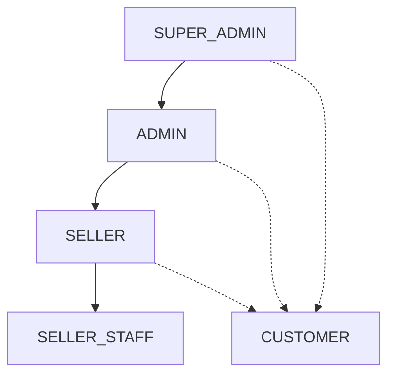
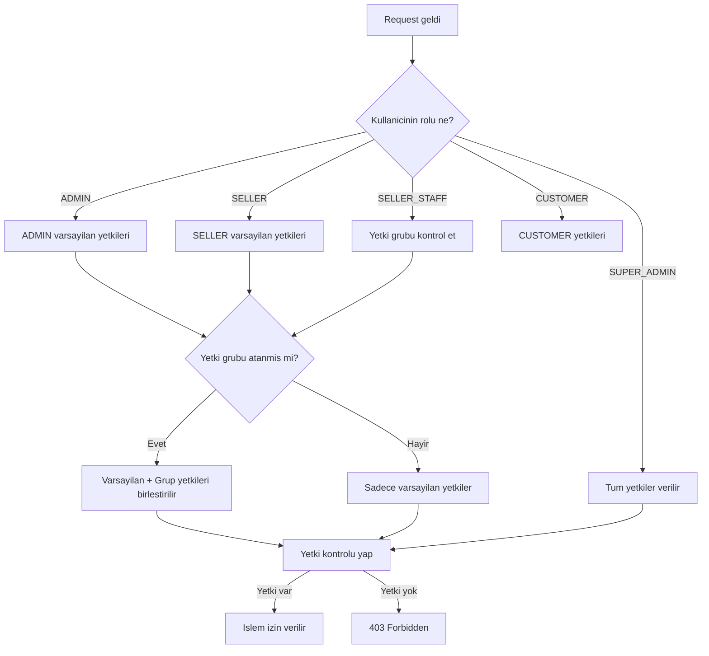

# Nutopiano — Rol & Yetki Matrisi Detay Dokümanı

> **Tarih:** 2026-02-28
> Bu doküman, admin paneli planlama dokümanının (v2) tamamlayıcısıdır.
> Roller, yetki grupları, permission enum yapısı ve rol-yetki matrisini detaylı olarak tanımlar.

---

## 1. Sistem Rolleri (Kimlik Seviyesi)

### 1.1 Rol Tanımları

| # | Rol Kodu | Görünen Ad | Seviye | Açıklama |
|---|----------|-----------|--------|----------|
| 1 | `SUPER_ADMIN` | Platform Yöneticisi | Platform | Tüm platform üzerinde sınırsız erişim. Sistem ayarları, komisyon oranları, global kategoriler, kullanıcı rol atama. |
| 2 | `ADMIN` | İş Yeri Yöneticisi | Business | İş yeri kapsamında tam erişim. Satıcı yönetimi, sipariş müdahale, finans izleme, raporlama, iade onayı. |
| 3 | `SELLER` | Satıcı | Seller | Kendi mağazası kapsamında tam erişim. Ürün, sipariş, müşteri, finans (kendi cüzdanı), POS. |
| 4 | `SELLER_STAFF` | Satıcı Personeli | Seller Staff | Satıcı altında çalışan personel. POS, sınırlı sipariş ve müşteri erişimi. Yetki grubu ile kontrol edilir. |
| 5 | `CUSTOMER` | Müşteri | Customer | Son kullanıcı. Mağaza, hesap, sipariş, adres, favori, değerlendirme. |

> **Not:** Mevcut `USER` rolü `SELLER_STAFF` olarak yeniden adlandırılacak. Migration sırasında geriye uyumluluk sağlanacak.

### 1.2 Rol Hiyerarşisi



**Kurallar:**
- `SUPER_ADMIN` → `ADMIN`'in tüm yetkilerine sahip + platform seviyesi yetkiler
- `ADMIN` → `SELLER`'ın tüm yetkilerine sahip + iş yeri yönetim yetkileri
- `SELLER` → Kendi mağazası kapsamında tam yetki
- `SELLER_STAFF` → Yetki grubu ile belirlenen sınırlı yetkiler
- `CUSTOMER` → Bağımsız, sadece müşteri yetkileri

### 1.3 SUPER_ADMIN vs ADMIN Sınır Çizgisi

| İşlem | SUPER_ADMIN | ADMIN |
|-------|:-----------:|:-----:|
| Sistem ayarları (vergi, komisyon, platform fee) | ✅ | ❌ |
| Global kategori yönetimi | ✅ | ❌ |
| Global kampanya yönetimi | ✅ | ❌ |
| Kullanıcı rol atama (ADMIN dahil) | ✅ | ❌ |
| Satıcı başvuru onaylama | ✅ | ✅ |
| Feature flag yönetimi | ✅ | ❌ |
| API key yönetimi | ✅ | ❌ |
| 2FA zorunluluk ayarı | ✅ | ❌ |
| Satıcı yönetimi | ✅ | ✅ |
| Sipariş müdahale | ✅ | ✅ |
| Finans izleme | ✅ | ✅ |
| Raporlama | ✅ | ✅ |
| İade onayı | ✅ | ✅ |
| Manuel bakiye düzeltme | ✅ | ✅ |
| Komisyon oranı değişimi | ✅ | ❌ |
| Payout onaylama | ✅ | ✅ |
| Impersonation | ✅ | ✅ (sınırlı) |

---

## 2. Permission Enum Yapısı

### 2.1 Temel Permission Enum

```typescript
export enum Permission {
  // ─── Kullanıcı Yönetimi ───
  USERS_VIEW = 'users.view',
  USERS_CREATE = 'users.create',
  USERS_EDIT = 'users.edit',
  USERS_DELETE = 'users.delete',
  USERS_ROLE_ASSIGN = 'users.role.assign',
  USERS_ACTIVATE = 'users.activate',
  USERS_2FA_MANAGE = 'users.2fa.manage',
  USERS_IMPERSONATE = 'users.impersonate',

  // ─── Satıcı Yönetimi ───
  SELLERS_VIEW = 'sellers.view',
  SELLERS_CREATE = 'sellers.create',
  SELLERS_EDIT = 'sellers.edit',
  SELLERS_ACTIVATE = 'sellers.activate',
  SELLERS_APPLICATIONS_VIEW = 'sellers.applications.view',
  SELLERS_APPLICATIONS_APPROVE = 'sellers.applications.approve',
  SELLERS_TEAM_VIEW = 'sellers.team.view',
  SELLERS_TEAM_MANAGE = 'sellers.team.manage',
  SELLERS_IMPERSONATE = 'sellers.impersonate',

  // ─── Ürün Yönetimi ───
  PRODUCTS_VIEW = 'products.view',
  PRODUCTS_CREATE = 'products.create',
  PRODUCTS_EDIT = 'products.edit',
  PRODUCTS_DELETE = 'products.delete',
  PRODUCTS_PUBLISH = 'products.publish',
  PRODUCTS_STOCK = 'products.stock',
  PRODUCTS_FORCE_PUBLISH = 'products.force_publish',
  PRODUCTS_FORCE_STOCK = 'products.force_stock',
  PRODUCTS_IMPORT = 'products.import',
  PRODUCTS_ARCHIVE = 'products.archive',

  // ─── Kategori Yönetimi ───
  CATEGORIES_VIEW = 'categories.view',
  CATEGORIES_CREATE = 'categories.create',
  CATEGORIES_EDIT = 'categories.edit',
  CATEGORIES_DELETE = 'categories.delete',
  CATEGORIES_REORDER = 'categories.reorder',

  // ─── Sipariş Yönetimi ───
  ORDERS_VIEW = 'orders.view',
  ORDERS_VIEW_ALL = 'orders.view_all',
  ORDERS_CREATE = 'orders.create',
  ORDERS_EDIT = 'orders.edit',
  ORDERS_STATUS_UPDATE = 'orders.status_update',
  ORDERS_CANCEL = 'orders.cancel',
  ORDERS_RETURN_PROCESS = 'orders.return.process',

  // ─── Müşteri Yönetimi ───
  CUSTOMERS_VIEW = 'customers.view',
  CUSTOMERS_CREATE = 'customers.create',
  CUSTOMERS_EDIT = 'customers.edit',
  CUSTOMERS_DELETE = 'customers.delete',
  CUSTOMERS_CREDIT_MANAGE = 'customers.credit.manage',

  // ─── Finans ───
  FINANCE_VIEW = 'finance.view',
  FINANCE_LEDGER_VIEW = 'finance.ledger.view',
  FINANCE_WALLETS_VIEW = 'finance.wallets.view',
  FINANCE_PAYOUT_VIEW = 'finance.payout.view',
  FINANCE_PAYOUT_APPROVE = 'finance.payout.approve',
  FINANCE_PAYOUT_REJECT = 'finance.payout.reject',
  FINANCE_REFUND_PROCESS = 'finance.refund.process',
  FINANCE_MANUAL_ADJUSTMENT = 'finance.manual_adjustment',
  FINANCE_COMMISSION_CONFIGURE = 'finance.commission.configure',
  FINANCE_TAX_CONFIGURE = 'finance.tax.configure',
  FINANCE_REPORT_EXPORT = 'finance.report.export',

  // ─── POS ───
  POS_SALES = 'pos.sales',
  POS_ORDERS = 'pos.orders',
  POS_REPORTS = 'pos.reports',
  POS_REGISTER_OPEN = 'pos.register.open',
  POS_REGISTER_CLOSE = 'pos.register.close',
  POS_RETURN = 'pos.return',
  POS_DISCOUNT = 'pos.discount',
  POS_OVERRIDE_PRICE = 'pos.override_price',
  POS_CASH_DRAWER = 'pos.cash_drawer',
  POS_REFUND_WITHOUT_MANAGER = 'pos.refund_without_manager',
  POS_VIEW_MARGIN = 'pos.view_margin',

  // ─── Raporlar ───
  REPORTS_VIEW = 'reports.view',
  REPORTS_EXPORT = 'reports.export',

  // ─── Sistem Ayarları ───
  SETTINGS_VIEW = 'settings.view',
  SETTINGS_EDIT = 'settings.edit',
  SETTINGS_SMTP = 'settings.smtp',
  SETTINGS_SMS = 'settings.sms',
  SETTINGS_PLANS = 'settings.plans',
  SETTINGS_FEATURE_FLAGS = 'settings.feature_flags',
  SETTINGS_API_KEYS = 'settings.api_keys',

  // ─── Denetim ───
  AUDIT_VIEW = 'audit.view',
  AUDIT_EXPORT = 'audit.export',
  OUTBOX_VIEW = 'outbox.view',
  OUTBOX_RETRY = 'outbox.retry',

  // ─── Destek ───
  SUPPORT_IMPERSONATE = 'support.impersonate',
  SUPPORT_PII_VIEW = 'support.pii_view',

  // ─── Toplu İşlemler ───
  BULK_PRODUCTS = 'bulk.products',
  BULK_ORDERS = 'bulk.orders',
  BULK_USERS = 'bulk.users',
}
```

### 2.2 Permission Grupları (Kategorize)

```typescript
export const PERMISSION_GROUPS = {
  USER_MANAGEMENT: [
    'users.view', 'users.create', 'users.edit', 'users.delete',
    'users.role.assign', 'users.activate', 'users.2fa.manage', 'users.impersonate',
  ],
  SELLER_MANAGEMENT: [
    'sellers.view', 'sellers.create', 'sellers.edit', 'sellers.activate',
    'sellers.applications.view', 'sellers.applications.approve',
    'sellers.team.view', 'sellers.team.manage', 'sellers.impersonate',
  ],
  PRODUCT_MANAGEMENT: [
    'products.view', 'products.create', 'products.edit', 'products.delete',
    'products.publish', 'products.stock', 'products.force_publish',
    'products.force_stock', 'products.import', 'products.archive',
  ],
  CATEGORY_MANAGEMENT: [
    'categories.view', 'categories.create', 'categories.edit',
    'categories.delete', 'categories.reorder',
  ],
  ORDER_MANAGEMENT: [
    'orders.view', 'orders.view_all', 'orders.create', 'orders.edit',
    'orders.status_update', 'orders.cancel', 'orders.return.process',
  ],
  CUSTOMER_MANAGEMENT: [
    'customers.view', 'customers.create', 'customers.edit',
    'customers.delete', 'customers.credit.manage',
  ],
  FINANCE: [
    'finance.view', 'finance.ledger.view', 'finance.wallets.view',
    'finance.payout.view', 'finance.payout.approve', 'finance.payout.reject',
    'finance.refund.process', 'finance.manual_adjustment',
    'finance.commission.configure', 'finance.tax.configure', 'finance.report.export',
  ],
  POS: [
    'pos.sales', 'pos.orders', 'pos.reports', 'pos.register.open',
    'pos.register.close', 'pos.return', 'pos.discount', 'pos.override_price',
    'pos.cash_drawer', 'pos.refund_without_manager', 'pos.view_margin',
  ],
  REPORTS: ['reports.view', 'reports.export'],
  SETTINGS: [
    'settings.view', 'settings.edit', 'settings.smtp', 'settings.sms',
    'settings.plans', 'settings.feature_flags', 'settings.api_keys',
  ],
  AUDIT: ['audit.view', 'audit.export', 'outbox.view', 'outbox.retry'],
  SUPPORT: ['support.impersonate', 'support.pii_view'],
  BULK: ['bulk.products', 'bulk.orders', 'bulk.users'],
} as const;
```

---

## 3. Rol-Permission Matrisi

### 3.1 SUPER_ADMIN Yetkileri

**Tüm yetkiler** — Sınırsız erişim.

### 3.2 ADMIN Yetkileri

| Yetki Grubu | Yetkiler | Notlar |
|-------------|----------|--------|
| Kullanıcı | `users.view`, `users.create`, `users.edit`, `users.delete`, `users.activate`, `users.2fa.manage` | ❌ `users.role.assign` (ADMIN atayamaz), ❌ `users.impersonate` (sınırlı) |
| Satıcı | Tümü | Tam satıcı yönetimi |
| Ürün | Tümü | Tam ürün yönetimi |
| Kategori | Tümü | Tam kategori yönetimi |
| Sipariş | Tümü | Tüm siparişleri görme dahil |
| Müşteri | Tümü | Tam müşteri yönetimi |
| Finans | `finance.view`, `finance.ledger.view`, `finance.wallets.view`, `finance.payout.view`, `finance.payout.approve`, `finance.payout.reject`, `finance.refund.process`, `finance.manual_adjustment`, `finance.report.export` | ❌ `finance.commission.configure`, ❌ `finance.tax.configure` |
| POS | Tümü | Tam POS erişimi |
| Raporlar | Tümü | Tam rapor erişimi |
| Ayarlar | `settings.view`, `settings.edit`, `settings.smtp`, `settings.sms`, `settings.plans` | ❌ `settings.feature_flags`, ❌ `settings.api_keys` |
| Denetim | Tümü | Tam denetim erişimi |
| Destek | `support.impersonate` (SELLER seviyesi), `support.pii_view` | ADMIN impersonate edemez |
| Toplu | Tümü | Tam toplu işlem |

### 3.3 SELLER Yetkileri

| Yetki Grubu | Yetkiler | Notlar |
|-------------|----------|--------|
| Kullanıcı | ❌ | Kullanıcı yönetimi yok |
| Satıcı | `sellers.team.view`, `sellers.team.manage` | Sadece kendi ekibi |
| Ürün | `products.view`, `products.create`, `products.edit`, `products.delete`, `products.publish`, `products.stock`, `products.import`, `products.archive` | ❌ `force_publish`, ❌ `force_stock` |
| Kategori | `categories.view` | Sadece görüntüleme (seller-scoped kategoriler oluşturabilir) |
| Sipariş | `orders.view`, `orders.create`, `orders.edit`, `orders.status_update`, `orders.cancel`, `orders.return.process` | Sadece kendi siparişleri, ❌ `orders.view_all` |
| Müşteri | `customers.view`, `customers.create`, `customers.edit`, `customers.credit.manage` | Sadece kendi müşterileri, ❌ `customers.delete` |
| Finans | `finance.view`, `finance.ledger.view`, `finance.wallets.view`, `finance.payout.view`, `finance.refund.process`, `finance.report.export` | Sadece kendi cüzdanı, ❌ `payout.approve/reject`, ❌ `manual_adjustment`, ❌ `commission/tax.configure` |
| POS | `pos.sales`, `pos.orders`, `pos.reports`, `pos.register.open`, `pos.register.close`, `pos.return`, `pos.discount`, `pos.override_price`, `pos.cash_drawer`, `pos.view_margin` | Tam POS (kendi mağazası), ❌ `pos.refund_without_manager` |
| Raporlar | `reports.view`, `reports.export` | Sadece kendi raporları |
| Ayarlar | ❌ | Sistem ayarları yok |
| Denetim | ❌ | Denetim erişimi yok |
| Destek | ❌ | Destek modu yok |
| Toplu | `bulk.products` | Sadece kendi ürünleri |

### 3.4 SELLER_STAFF Yetkileri (Yetki Grubu ile Kontrol)

SELLER_STAFF'ın varsayılan yetkileri **yetki grubu** ile belirlenir. Aşağıda preset gruplar:

---

## 4. SELLER_STAFF Yetki Grupları (Preset)

### 4.1 POS Kasiyer (Temel)

```
✅ pos.sales          — Satış yapma
✅ pos.orders         — Sipariş görme
✅ pos.register.open  — Kasa açma
✅ customers.view     — Müşteri seçme
✅ customers.create   — Yeni müşteri oluşturma
✅ products.view      — Ürün görme

❌ pos.discount       — İndirim yapamaz
❌ pos.override_price — Fiyat değiştiremez
❌ pos.return         — İade yapamaz
❌ pos.reports        — Rapor göremez
❌ pos.register.close — Kasa kapatamaz
❌ pos.cash_drawer    — Nakit çekmecesi açamaz
❌ pos.view_margin    — Maliyet/marj göremez
❌ finance.view       — Finans göremez
❌ products.edit      — Ürün düzenleyemez
❌ products.delete    — Ürün silemez
```

### 4.2 POS Şef Kasiyer

```
✅ pos.sales          — Satış yapma
✅ pos.orders         — Sipariş görme
✅ pos.register.open  — Kasa açma
✅ pos.register.close — Kasa kapatma
✅ pos.return         — İade yapma
✅ pos.discount       — İndirim yapma (hazır kampanya seçimi)
✅ pos.cash_drawer    — Nakit çekmecesi açma
✅ pos.reports        — Rapor görme
✅ customers.view     — Müşteri görme
✅ customers.create   — Müşteri oluşturma
✅ customers.edit     — Müşteri düzenleme
✅ products.view      — Ürün görme
✅ orders.view        — Sipariş görme
✅ orders.status_update — Sipariş durumu güncelleme

❌ pos.override_price — Fiyat değiştiremez
❌ pos.refund_without_manager — Yönetici olmadan iade yapamaz
❌ pos.view_margin    — Maliyet/marj göremez
❌ finance.view       — Finans göremez
❌ products.edit      — Ürün düzenleyemez
```

### 4.3 POS Mağaza Müdürü

```
✅ pos.sales          — Satış yapma
✅ pos.orders         — Sipariş görme
✅ pos.register.open  — Kasa açma
✅ pos.register.close — Kasa kapatma
✅ pos.return         — İade yapma
✅ pos.discount       — İndirim yapma
✅ pos.override_price — Fiyat değiştirme
✅ pos.cash_drawer    — Nakit çekmecesi açma
✅ pos.refund_without_manager — Yönetici olmadan iade
✅ pos.view_margin    — Maliyet/marj görme
✅ pos.reports        — Rapor görme
✅ customers.view     — Müşteri görme
✅ customers.create   — Müşteri oluşturma
✅ customers.edit     — Müşteri düzenleme
✅ customers.credit.manage — Bakiye yönetimi
✅ products.view      — Ürün görme
✅ products.edit      — Ürün düzenleme
✅ products.stock     — Stok güncelleme
✅ orders.view        — Sipariş görme
✅ orders.status_update — Sipariş durumu güncelleme
✅ orders.cancel      — Sipariş iptal
✅ orders.return.process — İade işleme
✅ finance.view       — Finans görme (kendi mağazası)
✅ reports.view       — Rapor görme

❌ products.delete    — Ürün silemez
❌ products.publish   — Ürün yayınlayamaz
❌ finance.manual_adjustment — Manuel düzeltme yapamaz
```

### 4.4 Depo Personeli (Warehouse)

```
✅ products.view      — Ürün görme
✅ products.stock     — Stok güncelleme
✅ orders.view        — Sipariş görme
✅ orders.status_update — Sipariş durumu güncelleme (kargo)

❌ Diğer tüm yetkiler
```

### 4.5 Finans Personeli (Finance Staff)

```
✅ finance.view       — Finans görme
✅ finance.ledger.view — Ledger görme
✅ finance.wallets.view — Cüzdan görme
✅ finance.payout.view — Payout görme
✅ finance.report.export — Rapor export
✅ orders.view        — Sipariş görme
✅ customers.view     — Müşteri görme
✅ reports.view       — Rapor görme
✅ reports.export     — Rapor export

❌ Yazma yetkileri (sadece okuma)
```

### 4.6 Müşteri Hizmetleri (Support Staff)

```
✅ orders.view        — Sipariş görme
✅ orders.status_update — Sipariş durumu güncelleme
✅ orders.return.process — İade işleme
✅ customers.view     — Müşteri görme
✅ customers.edit     — Müşteri düzenleme
✅ customers.credit.manage — Bakiye yönetimi

❌ Ürün yönetimi
❌ Finans yönetimi
❌ POS erişimi
```

---

## 5. Finans Yetki Ayrımı (Detaylı)

### 5.1 Finans İşlem Matrisi

| İşlem | SUPER_ADMIN | ADMIN | SELLER | SELLER_STAFF |
|-------|:-----------:|:-----:|:------:|:------------:|
| Finans özeti görme | ✅ | ✅ | ✅ (kendi) | Yetki grubuna bağlı |
| Ledger kayıtları görme | ✅ | ✅ | ✅ (kendi) | Yetki grubuna bağlı |
| Cüzdan bakiyesi görme | ✅ | ✅ | ✅ (kendi) | Yetki grubuna bağlı |
| Sipariş iptal | ✅ | ✅ | ✅ (kendi) | ❌ |
| Para iadesi başlatma | ✅ | ✅ | ✅ (limitli) | ❌ |
| Para iadesi onaylama | ✅ | ✅ | ❌ | ❌ |
| Manuel bakiye düzeltme | ✅ | ✅ | ❌ | ❌ |
| Komisyon oranı değişimi | ✅ | ❌ | ❌ | ❌ |
| Vergi ayarı değişimi | ✅ | ❌ | ❌ | ❌ |
| Platform fee değişimi | ✅ | ❌ | ❌ | ❌ |
| Payout talep oluşturma | ❌ | ❌ | ✅ | ❌ |
| Payout onaylama | ✅ | ✅ | ❌ | ❌ |
| Payout reddetme | ✅ | ✅ | ❌ | ❌ |
| Finansal rapor görme | ✅ | ✅ | ✅ (kendi) | Yetki grubuna bağlı |
| Finansal rapor export | ✅ | ✅ | ✅ (kendi) | Yetki grubuna bağlı |

### 5.2 İade Limitleri

| Rol | İade Limiti | Onay Gereksinimi |
|-----|------------|-----------------|
| SUPER_ADMIN | Sınırsız | Onay gerekmez |
| ADMIN | Sınırsız | Onay gerekmez |
| SELLER | Sipariş tutarının %100'üne kadar | Otomatik onay (ayarlanabilir limit) |
| SELLER_STAFF (Mağaza Müdürü) | Sipariş tutarının %50'sine kadar | SELLER onayı gerekir |
| SELLER_STAFF (Şef Kasiyer) | Sipariş tutarının %20'sine kadar | SELLER onayı gerekir |
| SELLER_STAFF (Kasiyer) | ❌ İade yapamaz | — |

### 5.3 İndirim Limitleri (POS)

| Rol | İndirim Limiti | Açıklama |
|-----|---------------|----------|
| SUPER_ADMIN | Sınırsız | — |
| ADMIN | Sınırsız | — |
| SELLER | %50'ye kadar | Ayarlanabilir |
| SELLER_STAFF (Mağaza Müdürü) | %30'a kadar | Ayarlanabilir |
| SELLER_STAFF (Şef Kasiyer) | Sadece hazır kampanya | Kampanya seçimi |
| SELLER_STAFF (Kasiyer) | ❌ İndirim yapamaz | — |

---

## 6. POS Personel Yetki Detayı

### 6.1 POS İşlem Matrisi

| POS İşlemi | Kasiyer | Şef Kasiyer | Mağaza Müdürü | SELLER | ADMIN |
|------------|:-------:|:-----------:|:-------------:|:------:|:-----:|
| Satış yapma | ✅ | ✅ | ✅ | ✅ | ✅ |
| Sipariş oluşturma | ✅ | ✅ | ✅ | ✅ | ✅ |
| Müşteri seçme | ✅ | ✅ | ✅ | ✅ | ✅ |
| Ödeme alma | ✅ | ✅ | ✅ | ✅ | ✅ |
| Fiş basma | ✅ | ✅ | ✅ | ✅ | ✅ |
| Kasa açma | ✅ | ✅ | ✅ | ✅ | ✅ |
| Kasa kapatma | ❌ | ✅ | ✅ | ✅ | ✅ |
| İade yapma | ❌ | ✅ (limitli) | ✅ | ✅ | ✅ |
| İndirim uygulama | ❌ | ✅ (kampanya) | ✅ (manuel) | ✅ | ✅ |
| Fiyat değiştirme | ❌ | ❌ | ✅ | ✅ | ✅ |
| Nakit çekmecesi açma | ❌ | ✅ | ✅ | ✅ | ✅ |
| Yönetici olmadan iade | ❌ | ❌ | ✅ | ✅ | ✅ |
| Maliyet/marj görme | ❌ | ❌ | ✅ | ✅ | ✅ |
| Gün sonu rapor | ❌ | ✅ | ✅ | ✅ | ✅ |
| Ürün düzenleme | ❌ | ❌ | ✅ | ✅ | ✅ |
| Stok güncelleme | ❌ | ❌ | ✅ | ✅ | ✅ |
| Ürün silme | ❌ | ❌ | ❌ | ✅ | ✅ |
| Finans görme | ❌ | ❌ | ✅ (kendi) | ✅ | ✅ |

---

## 7. Backend Implementasyon Detayları

### 7.1 Permission Guard (NestJS)

```typescript
// Decorator kullanımı
@UseGuards(JwtAuthGuard, PermissionGuard)
@RequirePermissions(Permission.ORDERS_VIEW, Permission.ORDERS_EDIT)
@Put('orders/:id')
async updateOrder() { ... }

// Herhangi birini gerektiren
@RequireAnyPermission(Permission.FINANCE_VIEW, Permission.REPORTS_VIEW)
@Get('dashboard/finance')
async getFinanceDashboard() { ... }
```

### 7.2 Permission Çözümleme Sırası



### 7.3 Scope Kontrolü (Veri Erişim Sınırı)

```typescript
// SELLER sadece kendi verilerini görebilir
// ADMIN tüm business verilerini görebilir
// SUPER_ADMIN tüm verileri görebilir

const scopeFilter = (user: AuthUser) => {
  if (user.role === 'SUPER_ADMIN') return {}; // sınırsız
  if (user.role === 'ADMIN') return { businessId: user.businessId };
  if (user.role === 'SELLER') return { businessId: user.businessId, sellerId: user.sellerId };
  if (user.role === 'SELLER_STAFF') return { businessId: user.businessId, sellerId: user.sellerId };
  return { businessId: user.businessId, customerId: user.customerId };
};
```

---

## 8. Migration Planı (USER → SELLER_STAFF)

### 8.1 Adımlar

1. **Prisma schema güncelleme** — `Role` enum'a `SELLER_STAFF` ekleme
2. **Migration** — Mevcut `USER` rolündeki kullanıcıları `SELLER_STAFF` olarak güncelleme
3. **Backend** — `LEGACY_ROLE_ALIASES` map'e `USER → SELLER_STAFF` ekleme (geriye uyumluluk)
4. **Frontend** — `role-routing.ts` ve `capabilities.ts` güncelleme
5. **Prisma schema** — `USER` enum değerini kaldırma (sonraki migration'da)

### 8.2 Geriye Uyumluluk

```typescript
const LEGACY_ROLE_ALIASES: Record<string, RoleType> = {
  STAFF: 'SELLER_STAFF',
  USER: 'SELLER_STAFF',  // geriye uyumluluk
};
```

---

## 9. Özet

| Konu | Karar |
|------|-------|
| Toplam sistem rolü | 5 (SUPER_ADMIN, ADMIN, SELLER, SELLER_STAFF, CUSTOMER) |
| USER rolü | SELLER_STAFF olarak yeniden adlandırılacak |
| Yetki sistemi | Permission enum + PermissionGroup |
| Toplam permission | 70+ granüler yetki |
| Preset yetki grupları | 6 (Kasiyer, Şef Kasiyer, Mağaza Müdürü, Depo, Finans, Destek) |
| Finans yetki ayrımı | Komisyon/vergi → SUPER_ADMIN, Manuel düzeltme → ADMIN, İade → Limitli |
| POS yetki ayrımı | 3 seviye (Kasiyer → Şef Kasiyer → Mağaza Müdürü) |
| SUPER_ADMIN vs ADMIN | Platform ayarları → SUPER_ADMIN, Operasyon → ADMIN |
| Scope kontrolü | Rol bazlı veri erişim sınırı (business, seller, customer) |
